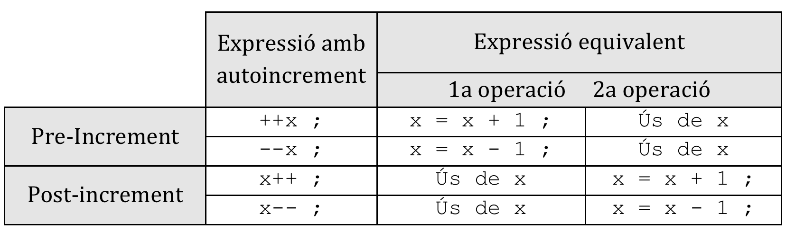
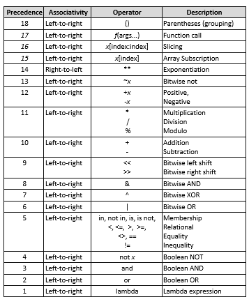
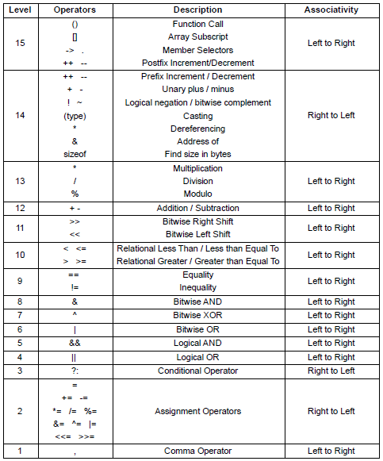

##   2.1 Tipus de dades

Els tipus de dades són els distints tipus d'informació que podem guardar a les nostres variables. Han anat evolucionant al llarg del temps, i cada vegada accepten valors més grans degut a les potències i capacitats cada cop més grans dels ordenadors.


### 2.1.1 Tipus elementals

Partirem de la taula de tipus que s'aplica en `C` i en `Java`, que estan molt més detallats.

|    TIPUS    |      SIGNIFICAT      |          BYTES          |               RANG DE VALORS                |
| :---------: | :------------------: | :---------------------: | :-----------------------------------------: |
|     str     | Cadena de caràcters  | 4 per caràcter en UTF-8 |             Segons codificació              |
|     int     |        Enter         |          2 o 4          |   [-2<sup>15</sup>  . .  2<sup>15</sup>]    |
|   boolean   |        Lògic         |          1 bit          |                True o False                 |
|    float    | Real simple precisió |            4            | [-3,4<sup>38</sup>  . .  3,4<sup>38</sup>]  |
|   double    | Real doble precisió  |            8            | [1,7<sup>308</sup>  . .  1,7<sup>308</sup>] |
| void o null |     (cap valor)      |            0            |                      -                      |

El tipus void/null serveix per a representar l’absència de valor, com per exemple en funcions que no retornen cap valor o quan no sabem alguna informació. Imaginem que tenim una variable entera `temperatura`, de la qual no sabem el valor. No podem dir que la temperatura és zero, ja que podriem pensar que si l'hem medit ( i evidentment fa fret).


### 2.1.1 `integer` o `int` 

Serveix per a representar nombres enters (sense decimals) amb signe. El tamany està limitat a la memòria del dispositiu. Per defecte el número enter es representa en el sistema decimal, però podem representar-lo en binari, octal i hexadecimal, afegint al principi del numero el prefix de la base en la qual ho representem:

???+ Example "Representacions de nombres enters"
    ```python
    print(11)     # mostra 11
    print(0o11)   # mostra 9
    print(0x11)   # mostra 17
    print(0b11)   # mostra 3
    ```


| Prefixe     | Significat  | Base |
| ----------- | ----------- | ---- |
| `0b` o `0B` | Binari      | 2    |
| `0o` o `0O` | Octal       | 8    |
| `0x` o `0X` | Hexadecimal | 16   |

Adonar-se que l'ordre de sortida `print` ho mostra sempre en decimal.

###  2.1.2 `float`

Serveix per a representar els numeros reals en notació de coma deximal. Podem representar també en notació científica afegint una `E` seguit d'un enter positiu o negatiu

???+ Example "Ús de tipus reals"

    ```python
    >>> 4.27
    4.27
    >>> type(4.27)
    <class 'float'>
    >>> 4.
    4.0
    >>> .27
    0.27
    >>> .4e7
    4000000.0
    >>> 4.2e-4
    0.00042
    ```

Els números reals estàn acotats:

- Els numeros més grans, positiu i negatiu: `1.79e308` i `-1.79e308`
- Els números més xicotets, positiu i negatiu: `5e-324` i `-5e-324`

> NOTA: `Python` també supporta els números complexes, que els veurem al llarg del curs

#### Modificadors dels tipus elementals

Servixen per a alterar els rangs dels tipus elementals vistos anteriorment. 
Existixen 2 tipus de modificadors:

- Modificadors de longitud:
    - `short`	→	per a enters (opció per defecte en alguns compiladors)
    - `long`  →		per a enters i reals. Dobla el rang
- Modificadors de signe (per a enters):
    - `signed`	→	amb signe (opció per defecte)
    - `unsigned` 	→	sense signe

Els valors màxims i mínims de cada tipus estan definits en les llibreries de cada llenguatge, i canvia segons els compiladors.

En `Python` hi han menys tipus, però tot i això no perdrem res de potència, donat que, per exemple els límits a partir de `Python3` no tenen topes

### 2.1.3 `bool`

Els valors lògis vertader i fals, especificats per `True` i `False`.

???+ Example
    ```python
    >>> type(True)
    <class 'bool'>
    >>> type(False)
    <class 'bool'>
    ```

### 2.1.4 `string` o `str`

El tipus `string` no existeix al llenguatge `C`, i es veu com una successió de caràcters. En `Java` ja va apareixer com a objecte i en `Python` ja és un tipus bàsic. Un `string` és una successió de 0 o més caràcters dins de cometes simples o dobles. Aquestes cometes no poden apareixer dins de la cadena, ja que la primera obri i l'última tanca:

```python
>>>print("Soc una cadena.")
Soc una cadena.
>>>print("Soc una "cadena.")
SyntaxError: invalid syntax
```

Posibles solucions:

- Intercanviar cometes dobles per simples, segons necessitats
- Fer servir el caracter contrabarra `\` que anula el significat dels simbols especials. Aquest caràcter es llig caracter de `escape` o `d'escapament`
- Fer servir com a inici de la cadena la cometa simple `'` i dins ja podem fer servir la cometa doble o vicerversa. 

???+ Example "Combinacions de símbols de cadena"
    ```python
    >>>print('Soc una "cadena.')
    Soc una "cadena.
    >>>print("Soc una \"cadena.")
    Soc una "cadena.
    >>>print("Soc una 'cadena.")
    Soc una 'cadena.
    ```

Aquest caràcter té molts usos també, ja que de vegades combinat amb altres caràcters podem aconseguir caràcter no imprimibles o de control:

| Seqüència de Escape | Significat                                      |
| ------------------- | ----------------------------------------------- |
| `\a`                | Alert. S'emet un pitit de l'altaveu             |
| `\b`                | Backspace. S'esborra un caràcter                |
| `\n`                | Line Feed. S'avança una línia                   |
| `\r`                | Carriage Return. Es torna el cursor al principi |
| `\t`                | Tabulador. S'avança                             |

???+Example "Més exemples:"

    ```python
    print("Exemple 1")
    print("Hola",end='')
    print("\t",end='')
    print("Adeu")

    print("Exemple 2")
    print("Hola",end='')
    print("\b",end='')
    print("Adeu")

    print("Exemple 3")
    print("Hola",end='')
    print("\r",end='')
    print("Adeu")

    print("Exemple 4")
    print("Hola",end='')
    print("\n",end='')
    print("Adeu")

    print("Exemple 5")
    print("Hola",end='')
    print("\f",end='')
    print("Adeu")
    ```

    ```text
    Exemple 1   
    Hola    Adeu    
    Exemple 2 
    HolAdeu
    Exemple 3
    Adeu                                                                  
    Exemple 4
    Hola
    Adeu  
    Exemple 5                                                            
    Hola         
        Adeu
    ```

## 2.2 Tipus compostos

Els tipus simples serveixen quan tenim que guardar una informació _simple_, és a dir formada per una sóla dada. Exemple són una temperatura, un nom, una edat, etc. La cosa ja canvia quan tenim que guardar una informació formada per varies dades, com per exemple una _data de naixement_. Com és evident, aquesta informació està formada per 3 informacions simples (dia, mes i any). Altre exemple seria una _adreça_, formada per tipus de carrer, nom del mateix, número, escala, codi postal, etc.

> Aquest tipus de dades s'estudiaran més endavant, i són tipus que els definirem els programadors, prenent com a base els bàsics que hem vist anteriorment.

## 2.3 Declaració de variables

Una variable és una porció de memòria (RAM), representada per un nom (identificador) on es guardarà un valor que pot variar al llarg de l’execució d’un programa.
Els llenguatges de programació, depenent de com es declaren les variables poden ser de tipat fort o dinàmic. Anem a veure-ho i veurem exemples.

Els llenguatges fortament tipat obliguen de indicar la variable de quin tipus serà abans de fer-la servir. Exemples d'aquest llenguatges són `C` i `Java`. Desprès al moment de fer servir les variables els llenguatges vigilen i controlen que el valor que s'emmagatzema correspon al tipus de la variable. Cas de no correspondre donarà error.

???+ Example "Llenguatge fortment tipat"
    ```java
    int n;      // diguem que n és enter
    float x;    // diguem que x és real

    n=10;         // OK
    n="hola";     // ERROR
    x=5.47;       // OK
    x=7;          // conversió:  x valdrà 7.0

    n=4.56        // semierror:  n valdrà 4, es perd la part real
    ```

Els llenguatges de **tipat dinàmic**, com poden ser `Python` o `PHP` no cal declarar la variable prèviament, simplement si ens cal una variable, li assignem el valor que vullguem i ja està. Mai ens ocorreran les situacios d'error d'abans. EL que ens pot ocòrrer és que una variable que contenia un numero, li assignem altre tipus i ens porte a situacions inconsistents. Tindrem que tenir molta cura en aquests casos.

???+ Example "Llenguatge de tipat feble"
    ```python
    n=10        # és int
    n=5.67      # ara és float
    n=6         # ara torna a ser int
    n=n+2       # int i val 8

    n="salut"   # ara n és str (String) , no dona error, pero...
    n=n+2       # ERROR, no li podem sumar 2 al text "salut"
    n=n*2       # ESPAI, multiplicar una cadena per un número el duplica "salutsalut"
    ```

> El tipat de `Python` es coneix també com a [Duck typing](https://en.wikipedia.org/wiki/Duck_typing)

## 2.4 Àmbit i visibilitat

Les variables (i constants) poden definir-se/declarar-se en qualsevol part del programa, però segons el lloc on siguen declarades, les podrem fer servir en tot el programa (globals) o només en alguna part (locals).

- La **visibilitat**	és la propietat que indica si es pot accedir o no a una variable en un punt determinat del programa.
- L’**àmbit** és la zona del programa on és visible una variable.

A partir d’estos conceptes podem diferenciar entre objectes locals i globals:

- Objectes locals: Variables (o constants) declarades dins d’un bloc o funció i, per tant, visibles només en l’àmbit d’eixe bloc i dins dels seus sub-blocs.
- Objectes globals: Variables (o constants) declarades al programa principal (fora del main) i, per tant, visibles des de qualsevol lloc del programa. 

Tenir en compte que:

- En `C` i `Java` anomenem bloc a tot allò que està entre claus { }. Per tant, qualsevol funció, com veurem més endavant, és un bloc.
- En `Python` un bloc són totes aquelles instruccions que estan al mateix nivell d'indentació, mitjançant tabulacions.

Cal tindre clar que si es declaren variables en un bloc (locals) oculten les variables amb el mateix nom globals.  

> Aquests conceptes s'estudiaran més endavant, quan treballem en la programació *modular*
 
## 2.5 Operadors i Expressions

Per tancar aquest tema anem a estudiar els operadors que disposem als nostres llenguatges, així com la manera d'interactuar amb l'usuari per a demanar-li dades i mostrar-li els resultats. Mitjançant els operadors podrem construir expressions complexes per a formar els nostres algorismes.

###  2.5.1 Operadors aritmètics

Anem a veure els operadors dels llenguatges de programació. La majoria són similars que `Java` o altres llenguatges, però hi han xicotetes diferències:

| Significat     | `Python` | `Java`     | Exemple                                      |
| -------------- | -------- | ---------- | -------------------------------------------- |
| Potència       | `**`     | no hi ha   | 3**2 retorna 9                               |
| Producte       | `*`      | `*`        | 3*6 retorna 18                               |
| Divisió        | `/`      | `/`        | 10/2  retorna 5                              |
|                |          |            | 11/2  retorna 5.5 en Python                  |
|                |          |            | 11/2  retorna 5 en Java (divisió entera)     |
| Divisió entera | `//`     | (`Python`) | 11/2 retorna 5                               |
| Residu         | `%`      | `%`        | 12/5 retorna 2 (residu de la divisió entera) |
| Suma           | `+`      | `+`        | 12 + 7 retorna 19                            |
| Resta          | `-`      | `-`        | 12 - 7 retorna 5                             |

No cal gaire explicació, donat que son els operadors matemàtics de sempre. Tindre especial cura en la divisió entera.

### 2.5.2 Operadors relacionals

Servixen per a comparar 2 expressions, retornant un valor lògic: vertader o fals. Son els mateixos en `Python` i en `Java`:

| Operador             | Significat    |
| -------------------- | ------------- |
| <                    | Menor         |
| >                    | Major         |
| ==                   | Igual         |
| != o <>(sols Python) | Distint       |
| <=                   | Menor o igual |
| >=                   | Major o igual |

### 2.5.3 Operadors lògics

Els operadors lògics són els de la taula següent. Serveixen per a composar distintes expressions lògiques:

| `Python` | `Java` | Significat      |
| -------- | ------ | --------------- |
| `or`     | `      |                 | ` | El _OR_ lògic |
| `and`    | `&&`   | La _AND_ lògica |
| `not`    | `!`    | El _NOT_ lògic  |

???+ Example
    ```python
    >>> a = True
    >>> b = False
    >>> a and b
    False
    >>> a or b
    True
    >>> not a
    False
    ```

#### Curtcircuit d’expressions

Si recordem les taules de veritat de les expressions lògiques, podem afirmar que:

- `false AND ...  	→ 	false`: false and els que siga sempre és false
- `true OR ... 		→	true`: true or el que siga sempre és true

Per tant, com les expressions s’avaluen d’esquerra a dreta, en el moment en què  puga assegurar el valor final de l’expressió lògica (true o false), pararà d’avaluar-la. Esta manera de treballar s’anomena curtcircuit d’expressions. Això ens dóna un benefici pel que fa a control d’errors i a velocitat d’execució.

Exemples:

```java
if ( (dto_1>0) || (dto_2>0) || (dto_3>0) )
	printf("S’ha aplicat algun descompte");
```

Si el `dto_1` és major que 0, ja no es comproven les altres 2 expressions i passa a executar-se directament el `print`.

```python
(x<0) and print("El valor de la variable x és negatiu")
```

Només es farà el printf si el valor de x és negatiu.

???+ Example "Exercici resolt Pensa què passaria en cada cas sense i amb curtcircuit d’expressions."

    ```python
    # Versió 1
    x=10
    y=0
    if ((x/y)>2 and (y!=0)):
      pass

    # Versió 2
    x=10;
    y=0;
    if ((y!=0) and (x/y)>2):
      pass
    ```
??? Example "Solució"
    > A la versió 1: 
    > ```python
    > if ((x/y)>2 and (y!=0)):                                                 
    > ZeroDivisionError: division by zero 
    > ```

    > A la versió 2 cap error

NOTA: l'ordre `pass` es fa servir quan volem deixar en blanc algun bloc de codi, com és el cas que sols volem provar les condicions

## 2.6 Operadors d’assignació

En tots els llenguatges de programació l’operador d’assignació és el símbol igual `=`. Aques operador necessita una variable a l'esquerre i una expressió a la dreta. El funcionament consistix en assignar a la variable el valor de l'expressió prèviament calculada. Funciona avaluant primer la part de la dreta, obtenint el seu resultat i assignant-lo a la variable de l’esquerra.


Per exemple: 		

```
x = 10;
y = 20;
x = x + 1;    # x valdrà 11
y = x + y;    # y valdrà 31
```

Per descomptat, l’assignació és destructiva, ja que elimina el valor antic de la variable. És a dir, només pot guardar una dada en un moment determinat.

Els llenguatges també permet assignar un valor a diverses variables en una assignació encadenada. Van assignat-se els valors de **dreta a esquerre**. `a=b=c=d=2`. L’expressió anterior és equivalent a fer les següents assignacions (i en eixe ordre):

```
d = 2;
c = d;
b = d;
a = d;
```

### Operadors aritmètics reduïts (**Operació-assignació**)

Existixen formes compactes d’escriure algunes operacions aritmètiques molt freqüents. Són els operadors reduïts:
•	Operadors d’actualització: `+=`, `-=`, `*=`, `/=` i `%=`
•	Operadors autoincrement i autodecrement: `++`, `--` (sols `C`i `Java`)
Estos operadors fan 2 coses: una operació i una assignació.

#### Operadors d’actualització

A banda del clàssic `=`, existixen 5 operadors més d’assignació, que estan formats amb els operadors aritmètics i l’operador `=`.

| Assignació reduïda | Assignació equivalent |
| ------------------ | --------------------- |
| `x += y `          | `x = x + y`           |
| `x -= y `          | `x = x - y`           |
| `x *= y `          | `x = x * y`           |
| `x /= y `          | `x = x / y`           |
| `x //= y `         | `x = x // y`          |
| `x %= y `          | `x = x % y`           |

On `x` és una variable i `y` una expressió, constant o variable.

???+ Example "Example d'assignacions"

    ```java
    int x, y;
    y = 1;
    x = 4;
    x += y;		// x = x + y 		→ x = 5
    x *= 2;		// x = x * 2 		→ x = 10
    x -= 3 - y; 	// x = x – (3 - y)	→ x = 10 – (2) 	→ x = 8
    ```

#### Operadors autoincrement i autodecrement (`Java`i `C`)

Els operadors incrementals `++` i `--` són operadors unaris que incrementen o decrementen en 1 unitat la variable a qui acompanyen. 

- Si l’operador va davant (`++x`), primer s’incrementa la variable i després s’utilitza el valor de la variable en l’expressió on apareix. 
- Si l’operador va després (`x++`), primer s’utilitza el valor de la variable en l’expressió i després s’incrementa la variable.




> Fixa't que pots trobar concursos de [programació ofuscada](https://www.ioccc.org)

## 2.7 Altres operadors

### 2.7.1 Operador condicional  `? :` (`Java`)

Sintaxi: `condició  ?  expressió_sí  :  expressió_no ;`
Exemples d’ús:

1. Assignar un valor diferent a una variable segons una condició:

```java
major = a > b ? a  : b ;
distancia = a > b ?   a – b  ; b – a;
num_positiu = num > 0 ? num  : -num  ;
```

2. Mostrar un valor diferent segons una condició:
```
printf(  edat>18 ?  “Adult” : “Infantil” );
```

3. Executar una instrucció diferent segons una condició:
```
edat>18?  printf(“Adult”)  : printf(“Infantil”);
```

Nota: també es poden posar operadors condicionals dins d’altres.

**Exercici proposat 1** Fes un programa que, donats 2 variables enteres, mostre quin és el número més gran i quin el més menut.


### 2.7.2 Operador sizeof

La quantitat de bytes que s’utilitza per a guardar un determinat tipus de dades depén de la versió del compilador i del tipus de processador que s’utilitze. Per tant, perquè el nostre programa puga ser portable, de vegades és necessari saber quants bytes ocupen les variables amb les quals treballarem.
Per a això, `C` i `Java` disposa de l’operador `sizeof()`, qui calcula la quantitat de bytes que ocupa la variable o tipus que li posem dins dels parèntesis `x = sizeof( variable o tipus )`.

???+ Example "En `Python` per a calcular-ho podem fer:"
    ```python
    import sys

    x=10
    text='10'

    print(sys.getsizeof(x),"bytes")
    print(sys.getsizeof(text), "bytes")
    ```

## 2.8 Expressions

Ara que ja hem vist els tipus d’operands i els operadors, ja podem formar expressions. Què pot ser una expressió?

-	Un valor (constant literal)
-	Una constant amb nom o una variable
-	Una funció
-	Una combinació dels elements anteriors amb operadors, els quals han de complir certes regles de construcció.
-	Res més és una expressió

## 2.9 Conversions de tipus

Dins d’una expressió poden aparéixer dades de distints tipus. Aleshores, el compilador ha de prendre una decisió de com fer el càlcul i no donar error.

### 2.9.1 Promoció interna
Si en una expressió hi ha dades de diferent tipus, el compilador transforma els tipus d’una grandària inferior al tipus de la dada de grandària superior.

`char → int → unsigned → long → unsigned long → float → double → long → double`

**Nota** Com `Python` no te tipat, això no passarà i sempre es canviarà el tipus de dades

### 2.9.2 Promoció per assignació
Esta conversió la fa el compilador quan s’intenta assignar a una variable una expressió de diferent tipus.

-	(int) = (char) 		→ no hi ha problema.
-	(char) = (int)  	→	s’elimina els bytes menys significatiu.
-	(int) = (float) 		→ 	es trunca la part fraccionària.
-	(float) = (double) 	→ 	s’arredonix el número

En els casos on es perd certa informació ens pot portar a resultats inesperats. Per tant, en eixos casos és recomana fer conversions forçades.

**Nota** Com `Python` no te tipat, això no passarà i sempre es canviarà el tipus de dades.

### 2.9.3 Promoció forçada o **Càsting**

En este cas no esperem que siga el compilador qui faça la promoció (conversió de tipus), sinó que serà el propi programador qui indique quina dada ha de canviar de tipus i a quin. S’especifica posant el tipus entre parèntesi just abans de l’expressió en `Java` o fent una crida a la funció que converteix el tipus en `Python`:

- `Java` → `(tipus) expressió`
- `Python`→ `tipus(expressió)`

???+ Example "Exemples:"

    ```java
    int n = 10; m = 3;
    float x, y;
    x = (float)(n/m) ; 	// (float) 3      → 3.0
    x = (float)n/m; 	// (float)(n) / m   → 10.0 / 3  →  3.3333..
    ```


## 2.10 Precedència i associativitat d’operadors

Ací tenim una relació dels operadors ordenats per precedència de major a menor. En cas d’igualtat de precedència de diversos operadors en una expressió, l’associativitat ens diu per on es comença a avaluar.

!!! note "Precedència i associativitat en Python"
    

!!! note "Precedència i associativitat en C i Java"
    


## 2.11 Entrada i eixida en Python

Les instruccions d’entrada i eixida (a partir d’ara E/S) permeten la construcció de programes interactius. És a dir, introduir dades des de teclat (`input`) i visualitzar en pantalla els resultats (`print`). 


Les funcions d’E/S es dividixen en 2 grups:

-	Sense format → es mostren els text i numeros com apareixen
-	Amb format → es formaten els numeros d'alguna manera especial

### 2.11.1 Sortida de dades: la funció `print`

Aquesta funció simplement mostra per pantalla allò que li se passa, que és un text. Anem a anar vegent-la de manera incremental, amb un codi comentat:

???+ Example
    ```python
    >>> print("Hola")
    Hola
    >>> print("Hola",'que tal?',"començant el curs")
    Hola que tal? començant el curs
    >>> print("Hola "+ "com va")
    Hola com va
    ```

com podem veure `print` rep un o més texts, que poden estar entre cometes simples o dobles. Aques texts els separa per blancs i afig un bot de línia al final de tota la unió de texts. Les cadenes de text poden concatenar-se també amb l'operador `+`, però llavors haurem de separar-les nosaltres l'espai en blanc.

La sintaxi completa és:

> `print(object(s), separator=separator, end=end, file=file, flush=flush)`
> - `object(s)` → son les cadenes de text o objectes que volem imprimir.
> - `separator=separator` → El símbol que volem fer servir per a separar els objectes anterior. Sinó posem res és l'espai en blanc
> - `end=end` → El simbol que farem servir al final de tota la impressió. Sinó posem res és el `enter` o bot de línia.
> - `file=file` → Sinó diguem res el text que s'escriu va a pantalla. Cas de voler enviar-ho a un fitxer, ací indicarem a quim (ho veurem al final del curs). El fitxer que simbolitza la pantalla és `sys.stdout` (el _standard output del sistema_)
> - `flush=flush` → aquest serà un valor boolea que indica si volem que la sortida es guarde (`True`) per a volcar-la tota de colp o si volem que tal i com s'execute es mostre (`False` i opció per defecte). Quan volem fer `flush` tot el que escrivim no es mostra i es guarda en un `buffer` o memòria temporal, fins que vullguem mostrar-ho tot de colp.

???+ Example

    ```python
    >>> print("Hola","com va tot?")
    Hola com va tot?
    >>> print("Hola","com va tot?",sep='#')
    Hola#com va tot?
    >>> print("Hola","com va tot?",sep='---')
    Hola---com va tot?
    >>> print("Hola","com va tot?",sep='---',end="@")
    Hola---com va tot?@>>>  # observa, sense bot de línia
    ```

#### Especificant el format

???+ Example "Combinant texts i nombres"

  ```python
  >>> print("Un enter es",4,"i un real és",3.256)
  Un enter es 4 i un real és 3.256
  >>> print("Un enter es" +4 +"i un real és" + 3.256)
  Traceback (most recent call last):
    File "<stdin>", line 1, in <module>
  TypeError: can only concatenate str (not "int") to str
  >>> print("Un enter es " + str(4) +" i un real és " + str(3.256))
  Un enter es 4 i un real és 3.256
  ```

vegem que:

- Si posem valors numerics amb els separadors no hi han problemes
- Si concatenem amb l'operador `+` **si** hi han problemes. Aquest problemes els podem solucionar convertint els números a cadenes amb la funció `str()`

Imaginem que volem imprimir certes hores del dia. EL que fariem és:

```python
print("Son les",4,"hores del dia",7,"de setembre i fa",7.27,"ºC")
print("Son les",16,"hores del dia",7,"de setembre i fa",15.27,"ºC")
print("Son les",23,"hores del dia",17,"de setembre i fa",9.2,"ºC")
print("Son les",3,"hores del dia",18,"de setembre i fa",10.3,"ºC")
```

la sortida que produeix és:

```
Son les 4 hores del dia 7 de setembre i fa 7.27 ºC
Son les 16 hores del dia 7 de setembre i fa 15.27 ºC
Son les 23 hores del dia 17 de setembre i fa 9.2 ºC
Son les 3 hores del dia 18 de setembre i fa 10.3 ºC
```

observem que cada cadena té una longitud distinta. El problema és que els numeros enters ocupen 1  o 2 caràcters, depenenet del número de xifres que tenen, i que els numeros decimal també varien la seua longitud. Això ho podem arreglar amb els especificadors de format:

- Per a números enters `%nd`, on `n` indica quants caràceters ha de omplir com a mínim
- Per a números reals `%n.mf`on `n` indica quants caràceters ha de omplir com a mínim i `m` indica els decimals que ha de mostrar

```python
print("Son les %2d hores del dia %2d de setembre i fa %6.3f"%(4,7,7.27))
print("Son les %2d hores del dia %2d de setembre i fa %6.3f"%(16,7,15.27))
print("Son les %2d hores del dia %2d de setembre i fa %6.3f"%(23,17,9.2))
print("Son les %2d hores del dia %2d de setembre i fa %6.3f"%(3,18,10.3))
```
la sortida que produeix és:
```
Son les  4 hores del dia  7 de setembre i fa  7.270
Son les 16 hores del dia  7 de setembre i fa 15.270
Son les 23 hores del dia 17 de setembre i fa  9.200
Son les  3 hores del dia 18 de setembre i fa 10.300
```

???+ Example "Més formats de cadenes"

    Les cadenes un cop construides les podem formatar i aliniar a esquerre, centre i dreta, tal i com es veu:

    ```python
    cadena="Això és un text"

    >>> print(cadena.ljust(60,'_'))
    Això és un text_____________________________________________

    >>> print(cadena.center(60,'_'))
    ______________________Això és un text_______________________

    >>> print(cadena.rjust(60,'_'))
    _____________________________________________Això és un text
    ```

Com es pot veure les función `.rjust`, `.center` i `.ljsut` justifiquen el text al que s'apliquen, ocupant els caràcter que s'indiquen en el primer argument, i omplint els buits amb el caràcter que s'indica en el segon argument (per defecte blanc).

Dins de les cadenes poden fer-se servir també els caràcters especials: `\a`, `\b`, `\n`,`\r`,`\t` i `\\` per a una contrabarra.

### 2.11.2 Entrada de dades: la funció `input`

La funció `input` llig allò que l'usuari ha escrit fins que polse un `enter`. És molt interessant posar com a argument allò que li volem preguntar, sinó hem de fer servir abnas la funció `print`. Exemple:

```python
print("Dis-me la teua edat")
edat=input()

# és molt més còmode fer
edat=input("Dis-me la teua edat")
```

El gran problema és que aquesta fució retorna un `str` i llavors, encara que el podem fer servir no podrem fer càlculs amb ells. La solució és fer un càsting o conversió de tipus segons la dada que volem llegir:

???+ Example "Llegir i transformar"
    ```python
    edat=int(input("Dis-me la teua edat: "))

    pes=float(input("Dis-me la teua pes: "))

    nom=input("Dis-me el teu nom: ")  # no cal fer conversió

    print("Hola",nom,", tens",edat,"anys i peses",pes,"kilos)
    ```

Si volem llegir diversos arguments alhora, separats per algun caracter especial, podem fer servir la funció `split` de la classe `str`:

???+ Example "Llegir i dividir"
    ```python
    pes, altura=input("Dis-me el pes i altura (separats per blanc): ").split()

    hores, minuts, segons=input("Dis-me l'hora exacta en format hh:mm:ss: ").split(":")
    
    # ATENCIO -> això ho retorna tot en format str. Hi hauria que fer desprès les conversión als formats adequats
    ```


