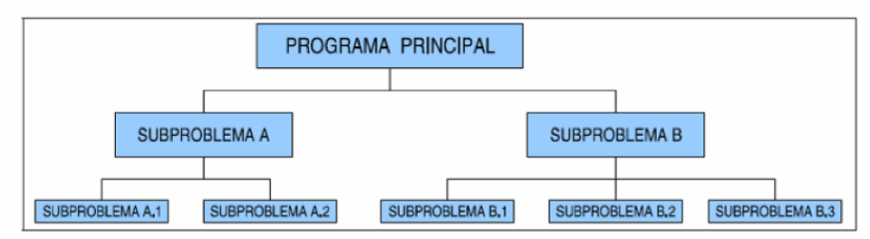

## 4.1 Què son i per a què s'utilitzen

Si un programa és molt llarg, és a dir, ocupa moltes línies de codi, tendix a complicar-se molt i a ser costós d’entendre. 

Per tant, basant-nos en la idea de _dividix i venceràs_, farem ús de la tècnica coneguda com descomposició modular, amb la qual cosa es descompon el programa (mòdul) en mòduls més xicotets i, per tant, més fàcils d’entendre. Eixe procés també és conegut com _disseny descendent_ o _top-down_.



Això s’aconseguix amb les subrutines. També anomenades **subprogrames**, **funcions**, **procediments**, **mòduls** o bé **mètodes**, en el cas de llenguatges orientats a objectes, com Java.

Cal anar fent eixa descomposició successivament. Però fins quan? Hem de parar de descompondre quan un mòdul (o funció, mètode...) faça una feina molt concreta.

!!! note "Definició de funció"
    Una funció és un bloc d’instruccions que executa una tasca concreta i a la qual se li dóna un nom. Esta funció és invocada des d’altra o altres funcions.

Els avantatges de la descomposició modular són:

- Facilita la resolució d’un problema.
- Facilita modificacions posteriors ja que els programes són més fàcils de llegir.
- Reduix el temps de desenvolupament, usant mòduls ja implementats.
- Diversos programadors poden col·laborar en la resolució d’un problema.
- Millora la depuració, ja que podem anar corregint mòduls individualment.

## 4.2. Declaració de funcions en `Python`

```python
def nom_funcio(param1, param2, ..., paramN):
    sentencia1	      # cos de la funció indentat
    ...
    sentenciaN
    [return expressio]
```

On tenim que:

- `def nomFuncio` serveix per a indicar que estem creant una funció, amb el nom indicat. El nom ha de complir les regles de creació dels noms.
- `param1, param2, ..., paramN ` → és la llista de paràmetres, separades per comes que seràn l'entrada de la funció.
- Desprès es posarà el caràcter `:` i a continuació un bloc indentat el cos de la funció.
- `return expressió` → Si la funció ha de retornar un valor, al final de la funció cal posar la paraula return junt a la dada o expressió que ha de retornar.

???+ Example "Funció que calcula la mitjana"
    ```python
    def calcMitja (suma, num):{
          mitjana=suma / num;
          return mitjana
    ```

## 4.3. Àmbit i visibilitat de varibles

Hi ha distints tipus de variables, sense tenir en compte el seu tipus. Es poden classificar atenent a diferents criteris, i el més important és **l’àmbit o visibilitat**, que és la _zona del programa on la variable és accessible_. Depén d’on s’ha declarat la variable:

- Variables globals 
- Variables locals
- Paràmetres formals

Altra classificació és segons el **temps de vida**: duració en memòria de la variable. Depén d’un especificador opcional de la variable. Ja es veurà més endavant.

### 4.3.1 Variables globals

Es definixen fora de les funcions (dins la classe en `Java`, o el programa principal en `Python`). El seu àmbit és qualsevol funció de la classe.

En `Python` son globals totes aquelles funcions que estan definides fora de qualssevol funció.

### 4.3.2 Variables locals

Es definixen al principi d’un bloc de sentències (bé d’una funció o d’un bloc anònim que hàgem creat, com un bucle).

El seu àmbit és el bloc on estan definides, i el temps d’execució és des que comença el bloc fins que acaba. És a dir: es crea quan s’entra al bloc i es destruix quan s’ix. 

???+ Example Exemple

```python
def func():
    local1=4; 		# Variable local a la funció func  
    ...
    if condicio:
        local2=32;   	#Variable local a este nou bloc.
        # La variable local1 també és accessible des d'ací,
        #  actuant com a global. 
        local2=2*local1
        ...
```

### 4.3.3 Paràmetres formals

Són variables d’enllaç entre la crida a una funció i la definició de la funció. 

Estan definides entre els parèntesis de la capçalera de la definició de la funció.

L’àmbit i comportament és el mateix que les variables locals en la funció on estan definides: es creen en entrar a la funció i es destruixen en eixir. 


???+ Example "Paràmetres formals"

    ```python
    def func (x, y, z):
      // x, y i z són paràmetres formals, que actuen com a locals a la funció func
      pass
      ...
    ```

Tenir en compte que canvis als paràmetres formal no afecten als actuals (als de la crida):

???+ Example
    ```python
    def sumar2(x,y):
      x=x+1
      return x+y

    a=3
    b=4
    print("a={} y b={} y la suma es {}".format(a,b,sumar2(a,b)))
    ```

Encara que es sume el valor a la x (local a la funció) el valor de a no és modifica (variable local).

## 4.4 Més sobre parámetres

### 4.4.1 Valor per defecte dels paràmters

En python podem asignar valors per defecte als paràmetres, inicialitzant-los en la pròpia funció. Això també ens permetrà el cridar-los sense importar la posició:

???+ Example "Proves de diversos arguments"

    ```python
    def volum(alt=10,ample=20,fons=30):
        print("El volumn de {}x{}x{}={}".format(alt,ample,fons,alt*ample*fons))
              
    volum()         
    # Valors per defecte 'El volumn de 10x20x30=6000'
    volum(50,60,70)
    # Valors dels paràmetres actuals 'El volumn de 50x60x70=210000'
    volum(ample=50)
    # Combinació 'El volumn de 10x50x30=15000'
    volum(40,fons=10,alt=20)
    # ERROR, a alt li assignem dos valors !!!
    ```

### 4.4.2 Paràmetres múltiples

De vegades no sabem quans paràmetres passare, com per exemple la funció `print()` que adment molts paràmetres, això ho aconseguim indicant que rebrem una colecció de paràmetres, com segueix:

???+ Example "Múltiples paràmtres"

    ```python
    def sumaMolts(*args):
        sum=0
        for num in args:
            sum+=num
        return sum

    print(sumaMolts(5))
    print(sumaMolts(5,5,2,7))
    print(sumaMolts())
    ```
> args és una col·lecció de tipus `tupla`, de la que parlarem més endavant

Si volem passar una col·lecció de atributs, valors, com si fos un diccionari podriem fer-ho amb la següent sintaxi:

???+ Example
    ```python
    def coleccion(**elements):
        print(type(elements))
        for elem in elements:
            print(elem,"-",elements[elem])

    coleccion(v1="hola",v2=35.56,v3=True,v4=None,v5='text')

    """ Eixida del programa
    <class 'dict'>
    v1 - hola
    v2 - 35.56
    v3 - True
    v4 - None
    v5 - text
    """
    ```

### 4.4.3 Tipat dels paràmetres

A python, desprès de la seua creació es va afegir la possibilitat d'indicar el tipat, tant dels paràmetres com el tipus de retorn, de la mateixa manera que Java:

```java
public int suma(int a, int b){
  return a+b;
}
```

```python
def suma(a:int,b:int) -> int:
    return a+b
```

Simplement és una eina per a la comprovació de tipat mitjançant eines externes, ja que l'interpret de Python no verifica res d'això. Més informació al següent [enllaç](https://peps.python.org/pep-0484/).

Eines per a comprovar els tipus podem trobar `mypy` o `pydantic` 