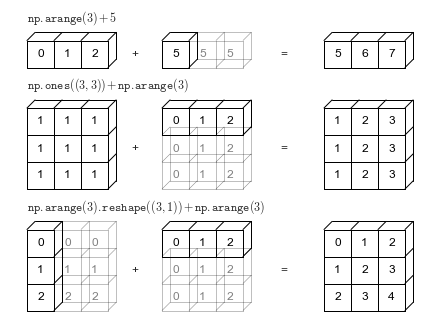

## 1. Introducció a NumPy

Els conjunts de dades a manipular poden tindre diferents naturaleses i formats, incloent documents, imatges, sons, mesures... A pesar d'aquesta aparent heterogeitat, poden ser tractats com a conjunt d'arrays numèrics. 

Per exemple, una imatge pot ser representada com un array bidimensional de números, on cada element representa el color del pixel que ocupa a l'array. El so pot ser representat com un array unidimensional, on cada element representa la frqüència front al temps. El text pot ser convertit a representació numèrica mitjançant UTF-8. No importa la naturalesa de les dades, el primer pas en l'anàlisi de dades serà convertir aquestes dades en números.

És per això que un emmagatzematge i manipulació eficient de les dades és absolutament fonamental en el procés d'anàlisi de dades, que ens permetran la construcció de programes d'Intel·ligència Artificial.

Ací és on entra en joc NumPy (Numerical Python), que ens ajudarà a carregar, manipular i guardar dades en format numèric. Un array de NumPy serà semblant a una llista (List) de Python, però de naturalesa homogènia i numèrica. 

NumPy és molt més eficient en el tractament de dades, sobretot quan la quantitat d'informació creix. Representa el nucli de l'ecosistema de ciència de dades amb Python. Aprendre'l serà beneficiós siga quin siga el camp d'interés.

Per a instal·lar NumPy, simplement heu d'executar l'ordre:

```bash
$ conda install numpy
```

Amb la següent ordre podem comprovar si s'ha instal·lat correctament i quina és la versió que tenim instal·lada.

```python
import numpy
numpy.__version__ # 1.24.3
```

Observareu que la majoria de gent importa utilitzant l'àlias *np*:

```python
import numpy as np
```

### 1.1. Numpy array vs Python List

En anteriors unitats, es va explicar que Python és un llenguatge de tipat dinàmic, per això permet la creació de llistes heterogènies:

```python
list_1 = [True, "2", 3.0, 4]
[type(item) for item in list_1] #[<class 'bool'>, <class 'str'>, <class 'float'>, <class 'int'>]
```

Però aquesta flexibilitat ve acompanyada d'un cost: cada element ha d'acompanyar-se del seu tipus, la seua posició en memòria i altra informació. Cada element és en realitat un objecte.

En canvi, si els elements son homogenis, molta d'aquesta informació seria redundant. Per això és molt més eficient aquest tipus de dades, tal com es mostra a la següent imatge:


La llista conté un punter a un bloc de punters, que apunten a cada objecte, mentre que NumPy apunta simplement a un bloc que conté les dades. És per això que és menys flexible però molt més eficient.

### 1.2. NumPy Arrays

!!! example "Creació d'arrays a partir de llistes"

      ```python
      # array([1, 4, 2, 5, 3])
      np.array([1, 4, 2, 5, 3])

      # array([3.14, 4.  , 2.  , 3.  ])
      np.array([3.14, 4, 2, 3])

      # array([1., 2., 3., 4.], dtype=float32)
      np.array([1, 2, 3, 4], dtype='float32')

      # array([[2, 3, 4],
      #        [4, 5, 6],
      #        [6, 7, 8]])
      np.array([range(i, i + 3) for i in [2, 4, 6]])
      ```

!!! example "Creació d'arrays des de zero"

      ```python
      #array([0, 0, 0, 0, 0, 0, 0, 0, 0, 0])
      np.zeros(10, dtype=int)

      # array([[1., 1., 1., 1., 1.],
      #        [1., 1., 1., 1., 1.],
      #        [1., 1., 1., 1., 1.]])
      np.ones((3, 5), dtype=float)

      # array([[3., 3., 3., 3., 3.],
      #       [3., 3., 3., 3., 3.],
      #       [3., 3., 3., 3., 3.]])
      np.full((3, 5), 3.)

      # array([ 0,  2,  4,  6,  8, 10, 12, 14, 16, 18])
      np.arange(0, 20, 2)

      # array([0.  , 0.25, 0.5 , 0.75, 1.  ])
      np.linspace(0, 1, 5)

      # array([[0.13718193, 0.00357101, 0.01323657],
      #        [0.39090681, 0.21454034, 0.74277238],
      #        [0.38737056, 0.96167256, 0.50637694]])
      np.random.random((3, 3))

      # matriu de 3x3 amb valors enters aleatòris
      np.random.randint(0, 10, (3, 3))
      ```


!!! example "Mostra aleatòria seguint una distribució normal o de Gauss"

      ```python
      mu, sigma = 0, 0.1
      s = np.random.normal(mu, sigma, 10000)
      import matplotlib.pyplot as plt
      count, bins, ignored = plt.hist(s, 100, density=True)
      plt.plot(bins, 1/(sigma * np.sqrt(2 * np.pi)) *
                  np.exp( - (bins - mu)**2 / (2 * sigma**2) ),
            linewidth=2, color='r')
      plt.show()
      ```
      

## 2. Manipulació d'arrays de NumPy

### 2.1. Atributs dels arrays
!!! example "Dimensions"

      ```python
      array = np.random.randint(10, size=(3, 4, 5))  # Array de tres dimensions
      print("número de dimensions: ", array.ndim)
      print("forma:", array.shape)
      print("tamany: ", array.size)
      ```
      número de dimensions:  3  
      forma: (3, 4, 5)  
      tamany:  60

!!! example "Tipus i espai ocupat per les dades"

      ```python
      print("tipus de dades:", array.dtype)
      print("tamany d'element:", array.itemsize, "bytes")
      print("tamany total:", array.nbytes, "bytes")
      ```

      tipus de dades: int64  
      tamany d'element: 8 bytes  
      tamany total: 480 bytes

### 2.2. Accés
!!! example "Accés als elements d'un array"

      ```python
      array = np.random.randint(10, size=6)
      print(array)
      print(array[3])
      print(array[-2])
      ```  
      [5 3 2 6 9 3]  
      6  
      9

      ```python
      array = np.random.randint(10, size=(3, 4))
      print(array)
      print(array[2, 0])
      print(array[2, -1])
      ```
      [[0 8 7 7]  
       [1 5 2 7]  
       [4 3 4 6]]  
      4  
      6

      ```python
      array[0, 0] = 12
      print(array)
      ```
      [[12  8  7  7]  
      [ 1  5  2  7]  
      [ 4  3  4  6]]

!!! question "Pregunta"
      
      Com quedarà la variable array després de la següent assignació?
      
      ```python
      array[0, 0] = 3.14159
      ```

??? success "Comprovar resposta"
      [[3  8  7  7]  
      [ 1  5  2  7]  
      [ 4  3  4  6]]

!!! question "Pregunta"

      Com quedarà la variable array després de la següent assignació?

      ```python
      array[1] = 3
      ```

??? success "Comprovar resposta"
      [[3  8  7  7]  
      [ 3  3  3  3]  
      [ 4  3  4  6]]  

### 2.3. Subarrays

#### 2.3.1. Unidimensionals

La forma general d'accedir a subarrays és:
```python
x[principi:fi:pas]
```  
on els valors per defcte són `principi=0, fi=tamany de la dimensió, pas=1`.

!!! example "Accedint a subarrays en arrays unidimensionals"

      ```python
      x = np.arange(10) # array([0, 1, 2, 3, 4, 5, 6, 7, 8, 9])
      x[:5] # array([0, 1, 2, 3, 4])
      x[4:7] # array([4, 5, 6])
      x[::2] # array([0, 2, 4, 6, 8])
      x[1::2] # array([1, 3, 5, 7, 9])
      ```

!!! warning "Compte amb passos negatius"

      ```python
      x[::-1]  # array([9, 8, 7, 6, 5, 4, 3, 2, 1, 0])
      ```
!!! question "Pregunta"

      Què contindrà la variable subarray al següent fragment de codi?  
      
      ```python
      import numpy as np
      x = np.arange(10)
      subarray = x[5::-2]
      ```

??? success "Comprovar resposta"

      ```python
      array([5, 3, 1])
      ```

#### 2.3.2. Multidimensionals

!!! example "Accedint a arrays multidimensionals"

      ```python
      x2 = np.array([[12,  5,  2,  4],
             [ 7,  6,  8,  8],
             [ 1,  6,  7,  7]])

      x2[:2, :3]  # array([[12,  5,  2],
                  #        [ 7,  6,  8]])

      x2[:3, ::2] # array([[12,  2],
                  #        [ 7,  8],
                  #        [ 1,  7]])

      x2[::-1, ::-1] # array([[ 7,  7,  6,  1],
                     #        [ 8,  8,  6,  7],
                     #        [ 4,  2,  5, 12]])
      ```

!!! example "Accedint a files o columnes"

      ```python
      x2[:, 0]    # array([12,  7,  1])

      x2[1, :]    # array([7, 6, 8, 8])
      ```

!!! warning "Accés per files abreviat"

      ```python
      x2[0] # seria equivalent a x2[0, :]
      ```

!!! danger "Subarrays com a vistes, no com a còpies"

      Una cosa a tindre molt en compte és que l'accés a un subarray no torna una còpia del mateix sinó una *vista*. És diferent en l'accés a llistes de Python, on les subllistes si que són còpies de l'objecte original.  
      Açò implica que treballant amb grans agrupacions de dades, nosaltres podem accedir i processar un subconjunt sense necessitat de copiar les dades.

      ```python
      x2_sub = x2[:2, :2] # array([[12,  5],
                          #        [ 7,  6]])
      x2_sub[0, 0] = 99
      x2    # array([[99,  5,  2,  4],
            #        [ 7,  6,  8,  8],
            #        [ 1,  6,  7,  7]])
      ```

#### 2.3.3. Còpies d'arrays

En cas que vulgam crear una còpia d'un array, podem fer ús del mètode *copy()*.

!!! example "Còpia d'un subarray"

      ```python
      x2_sub_copy = x2[:2, :2].copy()
      x2_sub_copy[0, 0] = 42
      x2    # array([[99,  5,  2,  4],
            #        [ 7,  6,  8,  8],
            #        [ 1,  6,  7,  7]])
      x2_sub_copy # array([[42,  5],
                  #        [ 7,  6]])
      ```

### 2.4. Canvi de dimensions

Una altra operació molt útil sobre arrays és el canvi de dimensions.

!!! example "Canvi de dimensions"

      ```python
      grid = np.arange(1, 10).reshape((3, 3)) # array([[1, 2, 3],
                                              #        [4, 5, 6],
                                              #        [7, 8, 9]])
      ```

### 2.5. Unió i separació

Per a unir arrays, s'utilitzen les funcions *concatenate*, *vstack* i *hstack*.

!!! example "Unió d'arrays"

      ```python
      x = np.array([1, 2, 3])
      y = np.array([3, 2, 1])
      np.concatenate([x, y])

      array([1, 2, 3, 3, 2, 1])

      grid = np.array([[1, 2, 3],
                 [4, 5, 6]])
      np.concatenate([grid, grid], axis=1)

      array([[1, 2, 3, 1, 2, 3],
             [4, 5, 6, 4, 5, 6]])

      x = np.array([1, 2, 3])
      grid = np.array([[9, 8, 7],
                  [6, 5, 4]])

      # vertically stack the arrays
      np.vstack([x, grid])

      array([[1, 2, 3],
             [9, 8, 7],
             [6, 5, 4]])

      # horizontally stack the arrays
      y = np.array([[99],
                  [99]])
      np.hstack([grid, y])

      array([[ 9,  8,  7, 99],
             [ 6,  5,  4, 99]])
      ```

De forma similar, per a partir arrays utilitzem les funcions *split*, *hsplit* i *vsplit*.

!!! example "Partició d'arrays"

      ```python
      x = [1, 2, 3, 99, 99, 3, 2, 1]
      # Split rep una llista amb les posicions per on partir com a argument
      x1, x2, x3 = np.split(x, [3, 5])
      print(x1, x2, x3)

      [1 2 3] [99 99] [3 2 1]

      upper, lower = np.vsplit(grid, [2])
      print(upper)
      print(lower)

      [[0 1 2 3]
       [4 5 6 7]]
      [[ 8  9 10 11]
       [12 13 14 15]]

      left, right = np.hsplit(grid, [2])
      print(left)
      print(right)

      [[ 0  1]
       [ 4  5]
       [ 8  9]
       [12 13]]
      [[ 2  3]
       [ 6  7]
       [10 11]
       [14 15]]
      ```

## 3. Funcions universals (ufuncs)

La implementació predeterminada de Python (coneguda com CPython) fa algunes operacions molt lentament.
Aquesta lentitud es fa evident en situacions en què es repeteix una operació sobre els elements d'una matriu. La lentitud no ve proporcionada per les operacions, sinó per les comprovacions de tipus (recordeu que estem davant un llenguatge interpretat i amb tipus dinàmics) i les crides a funcions en cada iteració.

La computació de matrius NumPy pot ser molt ràpida o molt lenta. La clau per fer-ho ràpid és utilitzar operacions vectoritzades, generalment implementades mitjançant les funcions universals de NumPy (ufuncs). Les funcions universals fan que s'executen de forma compilada totes aquestes operacions, de forma que la velocitat d'execució és rapidíssima.

!!! example "Operacions universals"

      ```python
      x = np.arange(4)
      print("x     =", x)
      print("x + 5 =", x + 5)
      print("x - 5 =", x - 5)
      print("x * 2 =", x * 2)
      print("x / 2 =", x / 2)
      print("x // 2 =", x // 2)

      x     = [0 1 2 3]
      x + 5 = [5 6 7 8]
      x - 5 = [-5 -4 -3 -2]
      x * 2 = [0 2 4 6]
      x / 2 = [ 0.   0.5  1.   1.5]
      x // 2 = [0 0 1 1]
      ```

Realment, aquestes operacions fan la crida a les versions compilades de Numpy add, subtract, divide...

## 4. Agregacions

La majoria de vegades, davant d'una gran quantitat de dades, el primer pas és calcular estadístiques de resum de les dades en qüestió. Habituals s'utilitzen la mitjana i la desviació estàndard, que permeten resumir els valors "típics" d'un conjunt de dades, però també són útils altres agregats (la suma, el producte, la mediana, el mínim i el màxim...).

NumPy té funcions d'agregació incorporades ràpides per treballar amb matrius. Recordeu sempre utilitzar estes funcions universals front a les funcions de Python estàndar.

La següent taula mostra les principals funcions d'agregació:

| Nom de la funció | Descripció                                           |
| ---------------- | ---------------------------------------------------- |
| np.sum           | Calcular la suma d'elements                          |
| np.prod          | Calcula el producte dels elements                    |
| np.mean          | Calcular la mitjana dels elements                    |
| np.std           | Calcular la desviació estàndard                      |
| np.var           | Calcular la variància                                |
| np.min           | Trobeu el valor mínim                                |
| np.max           | Trobeu el valor màxim                                |
| np.argmin        | Trobeu l'índex de valor mínim                        |
| np.argmax        | Trobeu l'índex de valor màxim                        |
| np.median        | Calcular la mediana dels elements                    |
| np.percentile    | Calcular estadístiques d'elements basades en el rang |
| np.any           | Avaluar si algun element és cert                     |
| np.all           | Avaluar si tots els elements són certs               |

Les agregacions poden ser al llarg d'una fila o columna:

!!! example "Agregacions a través de fila o columna"

      ```python
      M = np.random.random((3, 4))
      M.min(axis=0)
      M.min(axis=1)

      [[0.89601141 0.29981518 0.96231461 0.97286915]
       [0.68484684 0.89850248 0.48281439 0.24021478]
       [0.21160452 0.67449049 0.88807226 0.98416603]]
      [0.21160452 0.29981518 0.48281439 0.24021478]
      [0.29981518 0.24021478 0.21160452]
      ```

## 5. Càlcul en matrius: difusió

La difusió és un conjunt de regles per aplicar funcions universals (per exemple, sumes, restes, multiplicacions, etc.) a matrius de diferents mides.

!!! example "Agregacions a través de fila o columna"

      ```python
      a = np.array([0, 1, 2])
      a + 5
      # [5, 6, 7]

      M = np.ones((3, 3))
      M + a
      # [[ 1.,  2.,  3.],
      #  [ 1.,  2.,  3.],
      #  [ 1.,  2.,  3.]]

      a = np.arange(3)
      b = np.arange(3)[:, np.newaxis]
      print(a) # [0 1 2]
      print(b)
      # [[0]
      #  [1]
      #  [2]]
      a + b
      # [[0, 1, 2],
      #  [1, 2, 3],
      #  [2, 3, 4]]
      ```

      

## 6. Comparacions, màscares i lògica booleana

L'emmascarament s'utilitza quan voleu extreure, modificar, comptar o manipular valors d'una matriu en funció d'algun criteri: per exemple, és possible que vulgueu comptar tots els valors superiors a un determinat valor, o eliminar tots els valors atípics que estan per sobre d'algun valor llindar.

### 6.1. Exploració de dades

Imagineu que tenim una sèrie de dades que representen la quantitat de precipitació de cada dia durant un any en una ciutat determinada.

Si representem l'histograma de la quantitat de precipitacions podem observar la quantitat de dies que no va ploure, la quantitat de dies que va ploure poc,...

!!! example "Precipitacions a la ciutat de Seattle l'any 2014"
      ```python
      import pandas as pd

      # use pandas to extract rainfall inches as a NumPy array
      rainfall = pd.read_csv('data/Seattle2014.csv')['PRCP'].values

      %matplotlib inline
      import matplotlib.pyplot as plt
      import seaborn; seaborn.set()  # set plot styles
      plt.hist(rainfall, 40);
      ```
      

L'histograma dona una idea general de les dades, però no ens respon a preguntes com:
- Quants dies de pluja hi havia a l'any? 
- Quina és la precipitació mitjana en aquests dies de pluja? 
- Quants dies hi va haver amb més de la mitjana de pluja?

Algú podria pensar que amb funcions que recorreguen les dades i comptadors que es van incrementant segons es cumplisquen unes condicions ho podriem averiguar. Però això seria molt ineficient per les raons que hem comentat en apartats anteriors. Ací és on entren les comparacions, les màscares i la llògica de Boole.

### 6.2. Comparacions

NumPy implementa operadors de comparació com ara <(menor que) i >(més gran que) com a ufuncs per elements. El resultat d'aquests operadors de comparació és sempre una matriu amb un tipus de dades booleà.

!!! example "Comparacions en NumPy"
      ```python
      x = np.array([1, 2, 3, 4, 5])
      x < 3 
      
      [ True,  True, False, False, False]

      ( 2  *  x )  ==  ( x  **  2 )
      [Fals, True, False, False, False]
      ```

### 6.3. Matrius booleanes

#### 6.3.1. Recompte

Una forma d'obtindre quants valors complixen un criteri seria:

!!! example "Recompte"
      ```python
      x = np.array([[5, 0, 3, 3],
                [7, 9, 3, 5],
                [2, 4, 7, 6]])
      np.sum(x < 6)

      8

      np.sum(x < 6, axis=1)

      array([4, 2, 2])
      ```
Podem utilitzar les funcions *all* i *any* per veure si tots o algun dels elements complixen certa condició.

!!! example "Recompte"
      ```python
      np.any(x < 0) # Comprovem si hi ha negatius

      False

      np.all(x < 8, axis=1) # Comprovem si tots els elements de les files són majors a 8

      [ True, False,  True]
      ```

Les operacions anteriors es poden combinar amb els operadors lògics &(and), |(or), ^(xor) i ~(not).

## 7. Arrays boolean com a màscares

Per a emmascarar certs valors, utilitzarem els arrays booleans de forma que sols obtindrem els valors que tornen True:

!!! example "Emmascarament"
      ```python
      x [ x  <  5 ]

      [0, 3, 3, 3, 2, 4]
      ```
      Torna una matriu unidimensional amb els valors que complixen la condició.
      
Ara podriem obtindre dades com:
- la mitja de precipitacions dels dies que ha plogut.
- el dia d'estiu amb més precipitacions
- el dia, que no siga d'estiu, amb menys precipitacions

!!! tip "Combinació d'operacions"
      Combinant operacions booleanes, amb l'emmascarament i les funcions d'agregació, podem respondre a la majoria de les preguntes que ens poden interessar sobre les dades.

## 8. *Fancy Indexing*

A principi de l'apartat vegerem com accedir a elements d'un array de NumPy. Ara anem a estudiar una forma diferent d'accedir, el que s'anomena el *Fancy Indexing*, que pot aportar avantatges segons casos. La idea és molt simple, passar una matriu d'index per a accedir als element d'una matriu.

!!! example "Exemple de *fancy indexing*"
      ```python
      x = np.array([51, 92, 14, 71, 60, 20, 82, 86, 74, 74])
      [x[3], x[7], x[2]] # llista de Python

      [71, 86, 14]

      ind = [3, 7, 2]
      x[ind] # array de NumPy

      array([71, 86, 14])
      ```
      

!!! note "Dimensions de la matriu accedida"
      Quan s'utilitza *fancy indexing*, la forma del resultat reflecteix la forma de les matrius d'índex en lloc de la forma de la matriu que s'està indexant o accedint.

Funciona també amb matrius multidimensionals:

!!! example "*fancy indexing* a matrius multidimensionals"
      ```python
      X = np.arange(12).reshape((3, 4))

      # X = [[ 0,  1,  2,  3],
      #      [ 4,  5,  6,  7],
      #      [ 8,  9, 10, 11]]   

      row = np.array([0, 1, 2])
      col = np.array([2, 1, 3])
      X[row, col]
      
      # [[ 2,  5, 11]]

      X[row[:, np.newaxis], col]
      # [[ 2,  1,  3],
      #  [ 6,  5,  7],
      #  [10,  9, 11]]
      ```

### 8.1. Indexació combinada

Podem combinar *fancy indexing* amb la selecció simple, amb la selecció de subarrays o amb màscares:

!!! example "Exemple"
      ```python
      # X = [[ 0  1  2  3]
      #      [ 4  5  6  7]
      #      [ 8  9 10 11]]

      x[2, [2, 0 ,1]]
      # [10,  8,  9]

      X[1:, [2, 0, 1]]
      # [[ 6,  4,  5],
      #  [10,  8,  9]]

      mask = np.array([1, 0, 1, 0], dtype=bool)
      X[row[:, np.newaxis], mask]
      # [[ 0,  2],
      #  [ 4,  6],
      #  [ 8, 10]]
      ```

### 8.2. Exemple de selecció de valors aleatoris

Un dels usos més comuns del *fancy indexing* és la selecció de files aleatòries d'una matriu.

Imagineu una distribució com la següent:

```python
mean = [0, 0]
cov = [[1, 2],
       [2, 5]]
X = rand.multivariate_normal(mean, cov, 100)
X.shape #(100, 2)

%matplotlib inline
import matplotlib.pyplot as plt
import seaborn; seaborn.set()  # for plot styling

plt.scatter(X[:, 0], X[:, 1]);
```
<center>

{width=50%}

</center>

Podem utilitzar la *fancy indexing* per a seleccionar 20 punts aleatòris.

```python
indices = np.random.choice(X.shape[0], 20, replace=False)
# [26 25 78 48 34 50 43 87  4 14 53  1 88 44 23 49 72 84 66 40]

selection = X[indices]
# [[ 0.391316    1.60679404]
#  [-0.15204994 -0.78389108]
#  [-1.90507889 -4.08639424]
#  [-0.37348099 -0.61909868]
#  [-0.08723148 -0.90886801]

selection.shape # (20, 2)
```

Si ho representem en un gràfic de punts:

<center>

{width=50%}

</center>

### 8.3. Modificant valors amb *fancy indexing*

Amés de poder accedir de forma còmoda utilitzant el *fancy indexing* també podem modificar valors a través d'este mecanisme.

!!! example "Exemple"

      ```py
      x = np.arange(10)
      i = np.array([2, 1, 8, 4])
      x[i] = 99
      # [ 0 99 99  3 99  5  6  7 99  9]
      ```

!!! question "Pregunta"
      Quin serà el resultat d'executar el següent codi?

      ```python
      x = np.arange(10)
      i = np.array([2, 1, 8, 4])
      x[i] -= 10
      print(x)
      ```

??? succes "Resposta"

      ```python
      [ 0 89 89  3 89  5  6  7 89  9]      
      ```

      Tingues en compte que x[i] -= 10 substituix a x[i] = x[i] - 10, executat sobre cadascun dels índex.

!!! question "Pregunta"
      
      Quin serà el resultat d'executar el següent  fragment de codi?

      ```python
      x = np.zeros(10)
      x[[0, 0]] = [4, 6]
      print(x)
      ```

??? succes "Resposta"
      
      ```python
      [ 6.  0.  0.  0.  0.  0.  0.  0.  0.  0.]      
      ```

      Fixeu-se de nou, que l'assignació de nou s'executa dues vegades sobre el mateix índes, per tant, la segona elimina l'efecte de la primera i l'element de la posició zero serà 6.

!!! question "Pregunta"

      Quin serà el resultat d'executar el següent  fragment de codi?

      
      ```python
      i = [2, 3, 3, 4, 4, 4]
      x[i] += 1
      print(x)
      ```

??? succes "Resposta"
      
      ```python
      [ 6.,  0.,  1.,  1.,  1.,  0.,  0.,  0.,  0.,  0.]
      ```

      En este cas el resultat no és [ 6.,  0.,  1.,  2.,  3.,  0.,  0.,  0.,  0.,  0.] com s'esperaria, i això és perquè l'expressió `x[i] + 1` és avaluada a 1 al principi, i l'assignació `x[i] = x[i] + 1` es fa diverses vegades, sense incrementar el valor.

      Si voleu incrementar utilitzant el *fancy indexing* podeu utilitzar les funcions `at()`.

      ```python
      x = np.zeros(10)
      np.add.at(x, i, 1)
      print(x) # [ 0.  0.  1.  2.  3.  0.  0.  0.  0.  0.]
      ```

### 8.4. Creació de dades aleattòries amb el *fancy indexing*

Imagineu que volem agrupar una sèrie de valors en rangs definits per crear un histograma. Ho podem fer de la següent forma:

```python
np.random.seed(42) # la semilla ens proporciona valors pseudoaleatòris
x = np.random.randn(100)

bins = np.linspace(-5, 5, 21)
counts = np.zeros_like(bins)

i = np.searchsorted(bins, x) # torna l'índex on situar cada dada x

np.add.at(counts, i, 1) # incrementa counts en 1 cada vegada que apareix líndex
                        # de forma que tenim la freqüència

plt.plot(bins, counts, drawstyle='steps'); # creem un histograma
```

<center>

{width=50%}

</center>

Obtenim el mateix resultat si directament utilitzem la funció de matplotlib `hist()` que fa un tractament similar al que hem fet nosaltres manualment.

```python
plt.hist(x, bins, histtype='step');
```

## 9. Ordenació d'arrays

!!! question "Pregunta"
      
      Què fa el següent algorisme que rep com a entrada un array?

      ```python
      import numpy as np

      def selection_sort(x):
            for i in range(len(x)):
                  swap = i + np.argmin(x[i:])
                  (x[i], x[swap]) = (x[swap], x[i])
            return x
      ```

??? succes "Resposta"
      L'anterior algorisme és l'algorisme d'ordenació per selecció. En cada passada selecciona el mínim valor dels que queden a la dreta de l'actual i l'intercanvia. Té un cost de N^2. Requerix que per cada valor és recorrega l'array, un per a ordenar i l'altre per a trobar el mínim valor. Si creix molt el número d'elements, el cost computacional seria elevadíssim.


!!! question "Pregunta"

      Què fa el següent algorisme que rep com a entrada un array? Serà computacionalment més o menys costós que l'anterior?

      ```python
      def bogosort(x):
            while np.any(x[:-1] > x[1:]):
                  np.random.shuffle(x)
            return x
      ```

??? succes "Resposta"
      L'anterior algorisme és l'algorisme d'ordenació per barreja aleatòria. El seu cost és NxN! (N per N factorial). El factorial és de les funcions amb més ràpid creiximent. És tan costós que no s'hauria d'utilitzar mai en aplicacions reals.


### 9.1. `np.sort` i `np.argsort`

Afortunamdament tant python com numpy tenen algorismes d'ordenació molt més optimitzats que els anteriors.

```python
x = np.array([2, 1, 4, 3, 5])
x_sorted = np.sort(x)
index_sorted = np.argsort(x)
print(x_sorted) # [1 2 3 4 5]
print(f"{x} -> {index_sorted}") # [2 1 4 3 5] -> [1 0 3 2 4]
```

### 9.2. Ordenació per files o columnes

Una característica útil dels algorismes d'ordenació de NumPy és la capacitat d'ordenar al llarg de files o columnes específiques d'una matriu multidimensional mitjançant l'argument `axis`.

!!! example "Exemple"
      
      ```python
      rand = np.random.RandomState(42)
      X = rand.randint(0, 10, (4, 6))
      print(X)

      # [[6 3 7 4 6 9]
      #  [2 6 7 4 3 7]
      #  [7 2 5 4 1 7]
      #  [5 1 4 0 9 5]]

      print(np.sort(X, axis=0))

      # [[2 1 4 0 1 5]
      #  [5 2 5 4 3 7]
      #  [6 3 7 4 6 7]
      #  [7 6 7 4 9 9]]

      print(np.sort(X, axis=1))

      #  [[3 4 6 6 7 9]
      #  [2 3 4 6 7 7]
      #  [1 2 4 5 7 7]
      #  [0 1 4 5 5 9]]
      ```

### 9.3. Ordenació parcial `np.partition`

De vegades ens pot interessar no ordenar tot un array sinó trobar els k valors més menuts d'una matriu, encara que no s'ordene. Per a fer això podem utilitzar la funció `np.partition`. Esta funció rep un array i un número k. El resultat és un nou array amb els k números més menuts a l'esquerra de la partició i la part dreta amb la resta de valors. L'ordenació és arbitrària, és a dir, ninguna de les dos parts està ordenada, però estan els k més menuts a l'esquerra i després la resta.

!!! example "Exemple"
      
      ```python
      x = np.array([7, 2, 3, 1, 6, 5, 4])
      np.partition(x, 3) # [2, 1, 3, 4, 6, 5, 7]
      ```

També podem utilitzar esta funció a través d'un eix en una matriu multidimensional:

!!! example "Exemple"
      
      ```python
      rand = np.random.RandomState(42)
      X = rand.randint(0, 10, (4, 6))

      # [[6 3 7 4 6 9]
      # [2 6 7 4 3 7]
      # [7 2 5 4 1 7]
      # [5 1 4 0 9 5]]

      np.partition(X, 2, axis=1)

      # [[3, 4, 6, 7, 6, 9],
      #  [2, 3, 4, 7, 6, 7],
      #  [1, 2, 4, 5, 7, 7],
      #  [0, 1, 4, 5, 9, 5]]
      ```