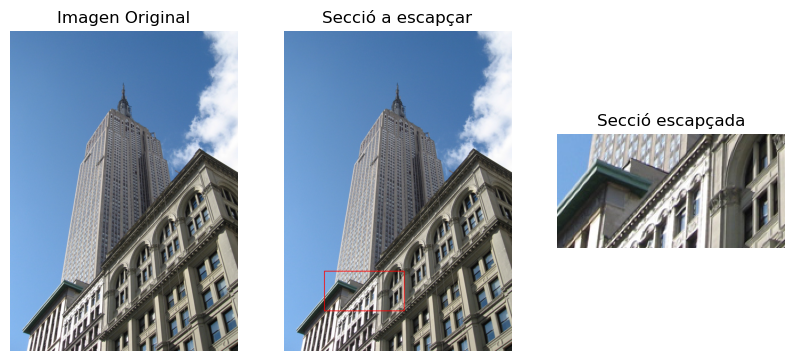

## 1. Introducció a OpenCV i PIL (Python Imaging Library):

OpenCV (**Open Source Computer Vision**) i PIL (**Python Imaging Library**) són dues potents llibreries de processament d'imatges en Python que ofereixen funcionalitats **complementàries** per a l'anàlisi, la manipulació i la millora d'imatges. Aquestes eines són essencials en diverses aplicacions, des del desenvolupament d'algoritmes de visió per computadora fins a la creació d'eines de processament d'imatges en projectes d'intel·ligència artificial.

**OpenCV:**

OpenCV és una llibreria de visió per computadora de codi obert, proporciona una àmplia varietat de funcions per al processament d'imatges i vídeo. Amb suport per a múltiples plataformes i llenguatges de programació, OpenCV facilita tasques com la detecció d'objectes, el seguiment de moviments, el reconeixement facial i la calibració de càmeres. La seva flexibilitat i eficiència fan que sigui una elecció popular en el desenvolupament d'aplicacions relacionades amb la visió per computadora.

**PIL:**

PIL, també coneguda com a **Pillow**, és una llibreria que ofereix eines robustes per a la manipulació d'imatges a Python. Tot i que ha estat substituïda per Pillow en termes de desenvolupament actiu, PIL encara es menciona pel seu llegat. Pillow manté la compatibilitat amb el codi PIL existent i afegeix noves característiques. Aquesta llibreria és ideal per a operacions bàsiques com obrir, manipular i desar imatges en diversos formats.

**Combinant OpenCV i PIL:**

La combinació d'OpenCV i PIL aprofita el millor de totes dues llibreries. **OpenCV ofereix algoritmes avançats i tècniques de visió per computadora, mentre que PIL proporciona funcions addicionals per al processament bàsic i la manipulació eficient d'imatges**. La integració d'aquestes dues eines permet als desenvolupadors abordar una àmplia gamma de reptes en el processament d'imatges, des de tasques senzilles fins a projectes més complexos que requereixen funcions especialitzades.

En aquest apartat, exploraràs com aprofitar de manera sinèrgica OpenCV i PIL per a maximitzar la teva capacitat per treballar amb imatges a Python, obtenint així una base sòlida per abordar projectes relacionats amb el processament d'imatges i la intel·ligència artificial.

## 1 Manipulació bàsica d'imatges

La classe més important de la biblioteca d'imatges de Python `PIL` és la classe `Image`, definida al mòdul amb el mateix nom. Podeu crear instàncies d'aquesta classe de diverses maneres; ja sigui carregant imatges dels fitxers, processant altres imatges o creant imatges des de zero.

### 1.1. Obrir i tancar
La manera més senzilla de crear-la és a partir d'un fitxer del sistema d'arxius, mitjançant `Image.open(ruta_a_la imatge)`.

Podrem mostrar algunes característiques amb els atributs:

- `format` → identifica la font d'una imatge, cas de llegir-se d'un fitxer
- `size` → és una tupla de 2 que conté l'amplada (width) i l'alçada (height) (en píxels). 
- `mode` → defineix el nom del mode de color: L per a grisos, RGB per a color, etc.

Per a desar una imatge ja processada, ho farem mitjançant `save(nom_del_fitxer)`. Això, depenent de la extensió que li posem, ens permetrà també canviar el format d'eixida.

???+ example "Càrrega i guardat d'imatge"
    ```python
    # Obrir una imatge i veure les seues característiques
    from PIL import Image
    import os

    img_input=os.path.join(image_path,"empire.jpg")
    im = Image.open(img_input)

    # mostar les seues característies
    print(im.format, im.size, im.mode)

    # mostar al sistema
    #im.show()

    # separem del nom la extensió
    f,e=os.path.splitext(img_input)

    # la canviem
    img_output=f+".png"

    #guardem
    im.save(img_output)
    ```

??? question "Intenta buscar i carregar una imatge descarregada directament desde Internet"
    ```python
    from PIL import Image
    import requests
    from io import BytesIO

    # URL 
    url = "https://upload.wikimedia.org/wikipedia/commons/2/25/PMSA-300.jpg"

    # Fem una petició GET
    response = requests.get(url)
    # A partir de la resposta creem un stream de Bytes
    img = Image.open(BytesIO(response.content))

    # Imatge a punt per a processar
    img.show()
    ```

### 1.2. Miniatures
Altre metode interessant és el de modificar la imatge per a fer minitures (`thumbnail`). Aquest mètode rep el shape al que volem transformar, i l'adapta per a mantenir la relació d'aspecte. Espai que aquest mètode transforma la imatge original

???+ example "Transformant el tamany"
    ```python
    new_size=(300,400)
    img_final=im.copy()
    img_final.thumbnail(new_size)
    img_final.show()
    ```

    > Si vullgesim crear una nova imatge com a còpia de la original, en compte de thumbnail podem fer servir el mètode `resize`, de manera semblant a `thumbnail`


!!! question "Exercici d'ampliació"
    A partir d'aquesta funció donada, investiga que fa cadascun dels mètodes que ess criden per a transformar la imatge

    ```python
    from PIL import Image, ImageOps
    size = (100, 150)
    with Image.open("la teua imatge") as im:
        ImageOps.contain(im, size).save("imageops_contain.png")
        ImageOps.cover(im, size).save("imageops_cover.png")
        ImageOps.fit(im, size).save("imageops_fit.png")
        ImageOps.pad(im, size, color="#f00").save("imageops_pad.png")

        # thumbnail() can also be used,
        # but will modify the image object in place
        im.thumbnail(size)
        im.save("imageops_thumbnail.png")
    ```

Com a ampliació crear una figura amb **matplotlib**, que es dibuixe en una graella `3x2` les imatges generades anteriorment. Passa com a imatge original alguna que siga més menuda que el 100x150 que tens al codi


### 1.3. Retallant i Pintant

Anem a veure com podem arar pintar damunt de la imatge i retallar alguna porció de la mateixa. Això ens resultarà particularment útil quan vullguem marcar sobre la imatge algun **punt singular** de la mateixa: un conjunt de cares, un vehicle i alguna part de la mateixa.

Amb les retalls (**crop**) aconseguirem crear una nova imatge amb allò que hem seleccionat, per a seguir processant allò que hem retallat. El més important per a aquestes operacions és tindre clar el sistema de coordenades de la imatge, que depenent de la documentació de la llibreria es farà d'una manera o altra:

En ambdós llibreries, OpenCV i PIL l'oritge de coordenades `(0,0)` serà el punt superior esquerre de la imatge. A partir d'ahi:

1. A la imatge anterior es pot comprovar que per marcar una caixa necessitarem 4 punts, especificats com una tupla `(x,y,w,h)`, on `x,y` son les coordenades superior esquerre de la caixa, i `w,h`:
<center>{width=75%}</center>
Aquesta notació també ens servirà per a dibuixar **rectangles**

2. En altres casos, com a la llibreria ImageDraw, les coordenades de la caixa seran una tupla de 4 números, però atenció `(x,y,x',y')`
<center>{width=75%}</center>

> Com sempre revisar la documentació dels mètodes a utilitzar

???+ example "EXemple de retall d'imartge"
    ```python
    from PIL import Image,ImageDraw

    # Llegim la imatge
    im = Image.open(img_input)

    # Definim la caixa a retallar
    caixa=(100,600,300,700)
    
    # Retallem la caixa, creant una nova imatge
    retall=im.crop(caixa)

    # Pintem sobre la imatge original un rectangle
    # es crea un dibuix obre la imatge original
    draw = ImageDraw.Draw(im)

    # afegim un rectangle, de color roig
    draw.rectangle(caixa, outline="red", width=2) 
    ```

El resultat seria:

<center>{width=100%}</center>

> Fixa't que la caixa que s'ha retallat te una dimensió de 200x100

## 2. 2 Filtrat i kernels

## 3. 3 Manipulació avançada d'imatges

## 4. 4 Visió per computador

### 4.1. Detección de objetos

### Reconocimiento facial

### 4.2. Seguimiento de objetos en movimiento

## XXNN Convolucionals

## 5. Projecte. Detecció d'emocions i punts característics en rostres

## 6. Projecte. Pasar llista a partir d'una imatge

## 7. Bibliografia

Programming Computer Vision with Python, de Jan Erik Solem