## 1. Introducció a OpenCV i PIL (Python Imaging Library):

OpenCV (**Open Source Computer Vision**) i PIL (**Python Imaging Library**) són dues potents llibreries de processament d'imatges en Python que ofereixen funcionalitats **complementàries** per a l'anàlisi, la manipulació i la millora d'imatges. Aquestes eines són essencials en diverses aplicacions, des del desenvolupament d'algoritmes de visió per computadora fins a la creació d'eines de processament d'imatges en projectes d'intel·ligència artificial.

**OpenCV:**

OpenCV és una llibreria de visió per computadora de codi obert, proporciona una àmplia varietat de funcions per al processament d'imatges i vídeo. Amb suport per a múltiples plataformes i llenguatges de programació, OpenCV facilita tasques com la detecció d'objectes, el seguiment de moviments, el reconeixement facial i la calibració de càmeres. La seva flexibilitat i eficiència fan que sigui una elecció popular en el desenvolupament d'aplicacions relacionades amb la visió per computadora.

**PIL:**

PIL, també coneguda com a **Pillow**, és una llibreria que ofereix eines robustes per a la manipulació d'imatges a Python. Tot i que ha estat substituïda per Pillow en termes de desenvolupament actiu, PIL encara es menciona pel seu llegat. Pillow manté la compatibilitat amb el codi PIL existent i afegeix noves característiques. Aquesta llibreria és ideal per a operacions bàsiques com obrir, manipular i desar imatges en diversos formats.

**Combinant OpenCV i PIL:**

La combinació d'OpenCV i PIL aprofita el millor de totes dues llibreries. **OpenCV ofereix algoritmes avançats i tècniques de visió per computadora, mentre que PIL proporciona funcions addicionals per al processament bàsic i la manipulació eficient d'imatges**. La integració d'aquestes dues eines permet als desenvolupadors abordar una àmplia gamma de reptes en el processament d'imatges, des de tasques senzilles fins a projectes més complexos que requereixen funcions especialitzades.

En aquest apartat, exploraràs com aprofitar de manera sinèrgica OpenCV i PIL per a maximitzar la teva capacitat per treballar amb imatges a Python, obtenint així una base sòlida per abordar projectes relacionats amb el processament d'imatges i la intel·ligència artificial.

Primer, aprendràs el següent:

* Llegir una imatge
* Comprovar els atributs de la imatge com ara el tipus de dades i la forma
* Representació de matriu d'una imatge en `Numpy`
* Imatges en color i separació/fusió de canals d'imatge
* Mostrar imatges utilitzant `matplotlib`
* Desar imatges

### Operacions basiques amb imatges

#### Obrint la imatge

OpenCV permet llegir diferents tipus d'imatges (JPG, PNG, etc). Pots carregar imatges en escala de grisos, imatges en color o també pots carregar imatges amb canal Alpha. Utilitza la funció `cv2.imread()` que té la següent sintaxi `img = cv2.imread(filename[,flags] )`, on:

- `img`: És la imatge si es carrega amb èxit. En cas contrari, és `None`. Això pot succeir si el nom del fitxer és incorrecte o si el fitxer està corrupte.
- `filename`: Pot ser una ruta **absoluta** o **relativa**. Aquest és un **argument obligatori**.
- `flags`: Aquestes banderes s'utilitzen per llegir una imatge en un format particular (per exemple, escala de grisos/color/amb canal alfa). Aquest és un **argument opcional** amb un valor per defecte de `cv2.IMREAD_COLOR` o `1`, que carrega la imatge com a imatge en color. Algunes de les `flags` disponibles:
  
    1. `cv2.IMREAD_GRAYSCALE`: Carrega la imatge en mode d'escala de grisos.
    2. `cv2.IMREAD_COLOR`: Carrega una imatge en color. Qualsevol transparència de la imatge serà ignorada. És la bandera per defecte.
    3. `cv2.IMREAD_UNCHANGED`: Carrega la imatge tal com és, incloent el canal alfa.

#### Mostrant atributs

Analitza el següent bloc de codi:

!!! Example "Mostrant la imatge"

    ```python
    #  mostrem les dimensions
    print("Image size (H, W) is:", img.shape)

    # mostrem els tipus de dades
    print("Data type of image is:", img.dtype)

    # imprimim la imatge
    print(img)

    # La mostrem... però
    plt.imshow(img)

    # En escala de grisos
    plt.imshow(img, cmap="gray")
    ```

Les ixides seran algo com:

<center>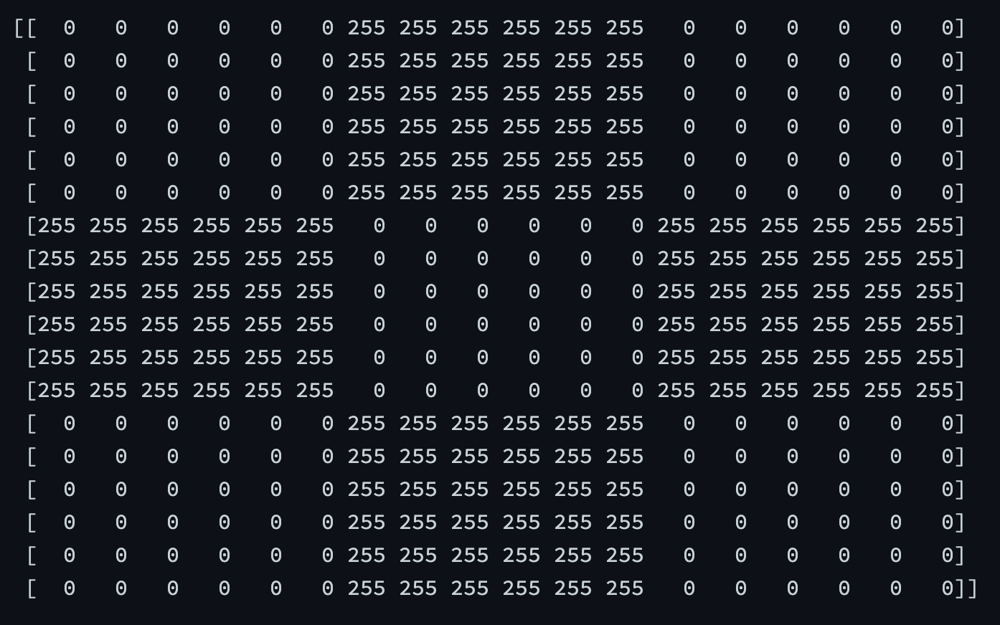{width=75%}</center>
<center>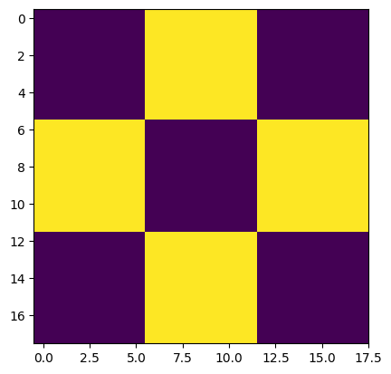{width=75%}</center>
<center>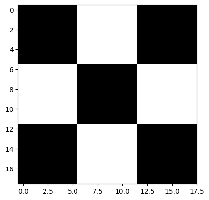{width=75%}</center>


Si la imatge llegida és en color, això ens crearà un array de numpy tridimensional, on cada píxel és una combinació de 3 canals RGB

!!! Example "Separant els canal de la imatge"

    ```python
    # Split the image into the B,G,R components
    img_NZ_bgr = cv2.imread("New_Zealand_Lake.jpg", cv2.IMREAD_COLOR)

    b, g, r = cv2.split(img_NZ_bgr)

    # Show the channels
    fig, axes = plt.subplots(nrows=1, ncols=4, figsize=(20, 6))
    axes = axes.flatten()

    axes[0].imshow(r, cmap="gray");axes[0].set_title("Canal Red")
    axes[1].imshow(g, cmap="gray");axes[1].set_title("Canal Green")
    axes[2].imshow(b, cmap="gray");axes[2].set_title("Canal Blue")

    imgMerged = cv2.merge((r, g, b))
    axes[3].imshow(imgMerged);axes[3].set_title("Merged Output")

    # Ajustar el espaciado entre los subplots
    plt.tight_layout()

    # Mostrar la figura
    plt.show()
    ```

Quedant el resultat com segueix:

<center>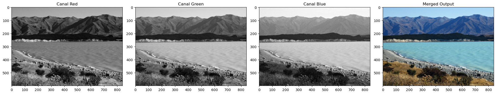{width=100%}</center>

#### Espais de colors

La funció `cv2.cvtColor()` Converteix una imatge d'un espai de colors a un altre. La funció converteix una imatge d'un espai de colors d'entrada a un altre. En cas d'una transformació des-de l'espai de colors RGB, l'ordre dels canals s'ha d'especificar explícitament (RGB o BGR). 

> Cal tenir en compte que el format de color per defecte a OpenCV sovint es denomina RGB, però en realitat és BGR (els bytes estan invertits). Per tant, el primer byte en una imatge de color estàndard (de 24 bits) serà un component Blau de 8 bits, el segon byte serà Verd i el tercer byte serà Vermell. El quart, cinquè i sisè bytes serien llavors el segon píxel (Blau, després Verd, després Vermell), i així successivament.

`dst = cv2.cvtColor(src,code)` on:

- `dst`: És la imatge de sortida amb la mateixa mida i profunditat que `src`.
- `src`: Imatge d'entrada
- `code`: Codi de conversió de l'espai de colors (vegeu [ColorConversionCodes](https://docs.opencv.org/4.5.1/d8/d01/group__imgproc__color__conversions.html#ga4e0972be5de079fed4e3a10e24ef5ef0")).

#### Guardant imatges

Guardar la imatge és tan senzill com llegir una imatge a OpenCV. Utilitzem la funció `cv2.imwrite()` amb dos arguments. El primer és el nom del fitxer i el segon és l'objecte imatge.

La funció imwrite guarda la imatge al fitxer especificat. El format de la imatge es tria en funció de l'extensió del nom del fitxer. En general, només es poden guardar imatges de 8 bits de canal únic o de 3 canals (amb ordre de canals 'BGR') utilitzant aquesta funció 

La funció és `cv2.imwrite( filename, img[, params] )`, on:

- `filename`: és el nom del fitxer amb l'extensió
- `img`: és la imatge que tenim carregada en memòria


### Manipulació bàsica imatges

#### Accedint a píxels individuals

Veurem com accedir a un píxel de la imatge. Donat que al carregar la imatge, és una matriu numpy, has d'utilitzar la notació de matriu com `img[f,c]`, on `f` és el número de fila i `c` és el número de columna. També cal tenir en compte que la matriu comença a l'índex 0.

Per exemple, si vols accedir al primer píxel, has de especificar img[0,0], però:

- si la imatge és en escala de grisos, tindràs un valor enter entre 0 i 255
- si la imatge és en color, tindràs un array de 3 valors entre 0 i 255, amb els valors BGR.

!!! Warning "Atenció: coordenades"
    <center>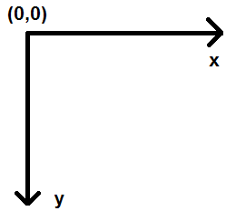{width=33%}</center>

    Vigila que cada llibreria pot diferir com avalua les coordenades. En openCV el punt (0,0) és el de dalt a l'esquerre i:

    - Les x van **cap a la dreta**
    - Les y van **cap a baix**


!!! example "Dibuixem diagonals"
    ```python
    img_orig = cv2.imread("checkerboard_18x18.png", cv2.IMREAD_GRAYSCALE)

    img_mod=img_orig.copy()   #sino modifiquem les dos

    # dibuixem les dos diagonals
    for i in range(img_orig.shape[0]):
      img_mod[i,i]=128                      #diagonal principal
      img_mod[img_orig.shape[0]-i-1,i]=128  #diagonal inversa

    fig, axes = plt.subplots(nrows=1, ncols=2, figsize=(12, 6))
    axes = axes.flatten()

    axes[0].imshow(img_orig, cmap="gray");axes[0].set_title("Original")
    axes[1].imshow(img_mod, cmap="gray");axes[1].set_title("Modificada")
    ```

    <center>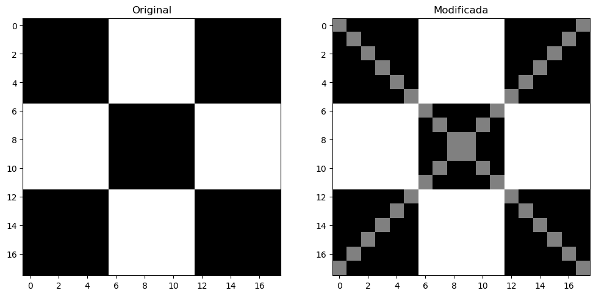{width=100%}</center>

#### Retallant (crop)

El fet de retallar una imatge no és me seleccionar una porció de la mateixa. Donat que una imatge és una matriu Numpy, ho farem amb els rangs de selecció d'imatges, és a dir l'operador dos punt.

!!! Exemple "Seleccionem el barco"

    ```python
    img_NZ_bgr = cv2.imread("New_Zealand_Boat.jpg", cv2.IMREAD_COLOR)
    img_NZ_rgb = img_NZ_bgr[:, :, ::-1]   # a RGB

    boat=img_NZ_rgb[200:400,200:600].copy()

    fig, axes = plt.subplots(nrows=1, ncols=2, figsize=(12, 6))
    axes = axes.flatten()

    axes[0].imshow(img_NZ_rgb);axes[0].set_title("Original")
    axes[1].imshow(boat);axes[1].set_title("Modificada")
    ```

    <center>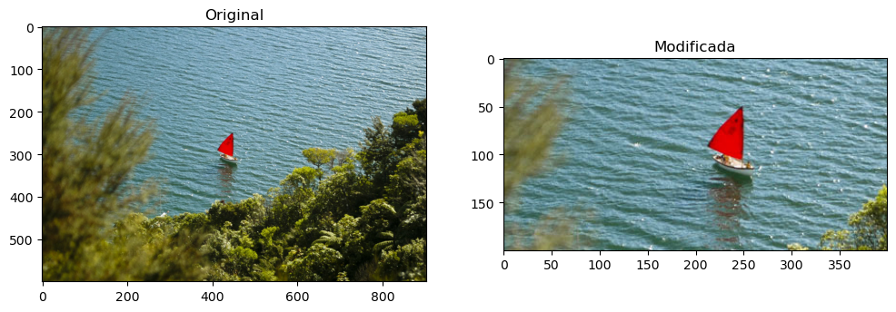{width=100%}</center>


??? question "Divideix una imatge en 4 porcions, 2 dalt i dos baix"
   
    ```python
    img_NZ_bgr = cv2.imread("New_Zealand_Boat.jpg", cv2.IMREAD_COLOR)
    img_NZ_rgb = img_NZ_bgr[:, :, ::-1]

    (height,width,col)=img_NZ_rgb.shape

    img_0=img_NZ_rgb[:height//2,:width//2].copy()
    img_1=img_NZ_rgb[height//2:,:width//2].copy()
    img_2=img_NZ_rgb[:height//2,width//2:].copy()
    img_3=img_NZ_rgb[height//2:,width//2:].copy()

    fig, axes = plt.subplots(nrows=2, ncols=2, figsize=(12, 12))
    axes = axes.flatten()

    axes[0].imshow(img_0);axes[0].set_title("Dalt Esquerre")
    axes[1].imshow(img_2);axes[1].set_title("Dalt Dreta")
    axes[2].imshow(img_1);axes[2].set_title("Baix Esquerre")
    axes[3].imshow(img_3);axes[3].set_title("Baix Dreta")

    plt.tight_layout()
    ```

    <center>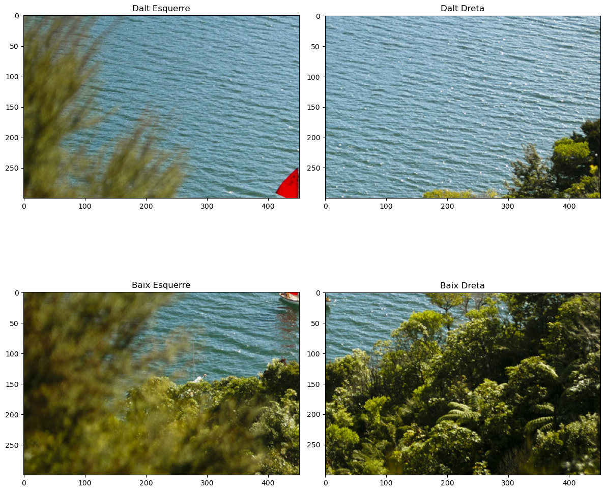{width=100%}</center>


#### Canviant les dimensions

La funció `resize` redimensiona la imatge `src` cap avall o cap amunt fins a la mida especificada. La mida i el tipus es deriven de `src`, `dsize`, `fx` i `fy`.

La sintaxi és `dst = resize( src, dsize[, dst[, fx[, fy[, interpolation]]]] )`, on:

- `dst`: imatge de sortida; té la mida `dsize` (quan és diferent de zero) o la mida calculada a partir de `src.size()`, `fx` i `fy`.
- `src`: imatge d'entrada
- `dsize`: mida de la imatge de sortida
- Opcionalment:
  
  - `fx`: factor d'escala a l'eix horitzontal; quan és igual a 0, es calcula com `(𝚍𝚘𝚞𝚋𝚕𝚎)𝚜𝚒𝚣𝚎.𝚠𝚒𝚍𝚝𝚑/𝚜𝚛𝚌.𝚌𝚘𝚕𝚜`
  - `fy`: factor d'escala a l'eix vertical; quan és igual a 0, es calcula com `(𝚍𝚘𝚞𝚋𝚕𝚎)𝚍𝚜𝚒𝚣𝚎.𝚑𝚎𝚒𝚐𝚑𝚝/𝚜𝚛𝚌.𝚛𝚘𝚠𝚜`

!!! example "Reescalem una imatge"
    
    ```python
    img_NZ_bgr = cv2.imread("New_Zealand_Boat.jpg", cv2.IMREAD_COLOR)
    img_NZ_rgb = img_NZ_bgr[:, :, ::-1]

    boat=img_NZ_rgb[200:400,200:600].copy()
    boat_2x_2x=cv2.resize(boat,None,fx=2,fy=2)
    boat_2x_1x=cv2.resize(boat,None,fx=2,fy=1)
    boat_1x_2x=cv2.resize(boat,None,fx=1,fy=2)

    fig, axes = plt.subplots(nrows=1, ncols=4, figsize=(20, 6))
    axes = axes.flatten()

    axes[0].imshow(boat);axes[0].set_title("Original "+str(boat.shape))
    axes[1].imshow(boat_2x_1x);axes[1].set_title("Doble llarg "+str(boat_2x_1x.shape))
    axes[2].imshow(boat_1x_2x);axes[2].set_title("Doble alt "+str(boat_1x_2x.shape))
    axes[3].imshow(boat_2x_2x);axes[3].set_title("Doble doble "+str(boat_2x_2x.shape))

    plt.tight_layout()
    ```

    <center>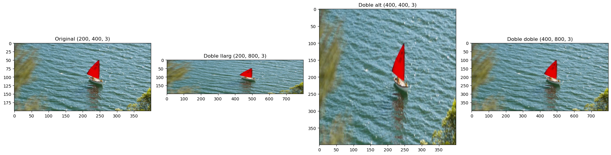{width=100%}</center>


#### Rotacions

La funció `flip` inverteix l'array de tres maneres diferents (els índexs de files i columnes comencen per 0). La sintaxi és `dst = cv.flip(src, flipCode)`:

- `dst`: array de sortida amb la mateixa mida i tipus que src. Els arguments són:

    - `src`: imatge d'entrada
    - `flipCode`: un indicador per especificar com voltejar l'array:
      - Un valor de 0 significa voltejar al voltant de l'eix `x`
      - Un valor positiu (per exemple, 1) significa voltejar al voltant de l'eix `y`.
      - Un valor negatiu (per exemple, -1) significa voltejar al voltant dels **dos eixos**.

Basicament hem d'entendre el _flip_ o _rotació_ com **l'invertir la imatge com un espill**. És l'efecte que ha de solventar-se quan fem una foto selfie.

!!! example "Diverses rotacions"

    ```python
    cola=cv2.imread("coca-cola-logo.png", cv2.IMREAD_COLOR)
    cola=cv2.cvtColor(cola,cv2.COLOR_BGR2RGB)

    cola_flip_H=cv2.flip(cola,1)
    cola_flip_V=cv2.flip(cola,0)
    cola_flip_HV=cv2.flip(cola,-1)

    fig, axes = plt.subplots(nrows=1, ncols=4, figsize=(20, 6))
    axes = axes.flatten()

    axes[0].imshow(cola);axes[0].set_title("Original ")
    axes[1].imshow(cola_flip_H);axes[1].set_title("Flop Horizontal")
    axes[2].imshow(cola_flip_V);axes[2].set_title("Flip Vertical")
    axes[3].imshow(cola_flip_HV);axes[3].set_title("Flip Horizontal i Vertical")  

    plt.tight_layout()
    ```

    <center>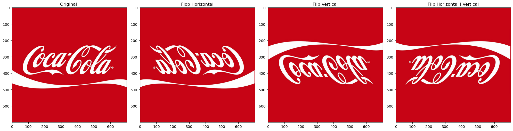{width=100%}</center>


### Anotant imatges

Una de les operacions que mes farem és el ressaltar parts de les imatges. Afegir algun text, enquadrar una cara, encerclar un objecte son tasques habituals a fer.

#### Línies


Comencem dibuixant una línia en una imatge. Utilitzarem la funció `cv2.line` per a això, la sintaxi de la qual és `img_out = cv2.line(img_in, pt1, pt2, color[, thickness[, lineType[, shift]]])`, on:

- `img_out`: La imatge de sortida que contindrà l'anotació, i com a paràmetres:

  1. `img_in`: Imatge en la qual dibuixarem una línia.
  2. `pt1`: Primer punt, ubicació (x, y) del segment de línia.
  3. `pt2`: Segon punt del segment de línia.
  4. `color`: Color de la línia que es dibuixarà.
  5. `thickness`: Enter que especifica l'amplada de la línia. El valor per defecte és 1.
  6. `lineType`: Tipus de línia. El valor per defecte és 8, que representa una línia de 8 connexions. Normalment, s'utilitza cv2.LINE_AA (línia antialiasing o suau) per al lineType.

Més informació a la [web oficial](https://docs.opencv.org/4.5.1/d6/d6e/group__imgproc__draw.html#ga7078a9fae8c7e7d13d24dac2520ae4a2).


#### Cercles

Utilitzarem la funció `cv2.circle` per a això. La sintaxi és `img_out = cv2.circle(img_in, center, radius, color[, thickness[, lineType[, shift]]])`, on:

- `img_out`: La imatge de sortida que ha estat anotada, i els arguments són:

1. `img_in`: Imatge en la qual dibuixarem un cercle.
2. `center`: Centre del cercle `(x, y)` .
3. `radius`: Radi del cercle.
4. `color`:  Color del cercle que es dibuixarà.
5. `thickness`: Gruix del contorn del cercle (si és positiu).
Si s'indica un valor negatiu per a aquest argument, es dibuixarà un cercle ple.
1. `lineType`:  Tipus de línia del contorn del cercle. 
 
#### Rectangles

Utilitzarem la funció `cv2.rectangle` per dibuixar un rectangle en una imatge. La sintaxi de la funció és la següent `img_out = cv2.rectangle(img_in, pt1, pt2, color[, thickness[, lineType[, shift]]])` on:

- `img_out`: La imatge de sortida que ha estat anotada.

- `img_in`: Imatge en la qual es dibuixarà el rectangle.

- `pt1`: Vèrtex del rectangle. Normalment, utilitzem el **vèrtex superior esquerra** aquí.
- `pt2`: Vèrtex del rectangle oposat a `pt1`. Normalment, utilitzem el **vèrtex inferior dret** aquí.
- `color`: Color del rectangle.
- `thickness`: Gruix del contorn del rectangle (si és positiu). Si s'indica un valor negatiu per a aquest argument, es dibuixarà un rectangle ple.
- `lineType`: Tipus de línia del contorn del rectangle. És el mateix argument lineType que s'utilitza en **cv2.line**.

#### Texts

Finalment, veurem com podem escriure text en una imatge utilitzant la funció **cv2.putText**. La sintaxi és `img_out = cv2.putText(img_in, text, org, fontFace, fontScale, color[, thickness[, lineType[, bottomLeftOrigin]]])`, on:

- `img_out`: La imatge de sortida que ha estat anotada.
- `img_in`: Imatge en la qual s'ha d'escriure el text.
- `text`: Cadena de text a escriure.
- `org`: Cantó inferior esquerra de la cadena de text a la imatge, com una tupla `(x,y)`
- `fontFace`: Tipus de font. Consultar la documentació per veure els tipus vàlids (`cv2.FONT_`)
- `fontScale`: Factor d'escala de la font que es multiplica per la mida base específica de la font.
- `color`: Color de la font.

!!! question "Exercici Pintem sobre la imatge"
    Sobre la imatge a continuació (el enlariament de l'Apol·lo XI):

    <center>{width=90%}</center>

    Aplícla-li:

    - Un títol a la part de baix, amb el text que consideres
    - Un requadre que tanque el cohet
    - Una cercle que tanque un objecte extrany a la dreta del cohet
    - Una línia horizontal de banda a banda de la imatgeque coincidisca amb la punta del cohet.
  
    Deurà quedar alguna cosa similar a:

    <center>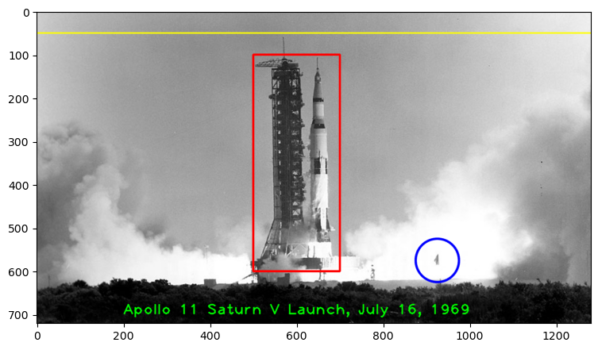{width=90%}</center>

??? question "Sol·lució"

    ```python
    image = cv2.imread("Apollo_11_Launch.jpg", cv2.IMREAD_COLOR)

    (h,w,d) = image.shape   # Dimensions de la imatge

    image_out = image.copy()
    text = "Apollo 11 Saturn V Launch, July 16, 1969"
    fontScale = 2.3
    fontFace = cv2.FONT_HERSHEY_PLAIN
    fontColor = (0, 255, 0)
    fontThickness = 2

    image_out=cv2.putText(image_out, text, (200, 700), fontFace, fontScale, fontColor, fontThickness, cv2.LINE_AA);

    image_out=cv2.rectangle(image_out, (500, 100), (700, 600), (255, 0, 0), thickness=3, lineType=cv2.LINE_8)

    image_out=cv2.circle(image_out, (925, 575), 50, (0, 0, 255), thickness=3, lineType=cv2.LINE_AA)

    image_out=cv2.line(image_out, (0, 50), (w, 50), (255, 255, 0), thickness=2, lineType=cv2.LINE_AA)
    plt.imshow(image_out)
    ```

### Aplicant filtres

Els filtres a les imatges poden resultar interessant per diversos motius, ja no sols el retoc fotogràfic, sinò per exemple l'augmentació de datasets i la recerca de punts singulars a les imatges.

#### Suma per modifcar la brillantor (_brigthness_)

La primera operació que discutim és la simple suma d'imatges. Això resulta en augmentar o disminuir la brillantor de la imatge ja que finalment estem augmentant o disminuint els valors d'intensitat de cada píxel en la mateixa quantitat. Això donarà com a resultat un augment/disminució global de la brillantor.

Recorda que com **una imatge és un numpy array**, podem sumar matrius de manera molt simple, com veurem a continuació:

!!! Example "Modificant la llum de la imatge"

    ```python
    img_bgr = cv2.imread("coca-cola-logo.png", cv2.IMREAD_COLOR)
    img_rgb = cv2.cvtColor(img_bgr, cv2.COLOR_BGR2RGB)

    # Una matris de 50's. És la que sumarem
    matrix = np.ones(img_rgb.shape, dtype="uint8") * 50

    # dos més fosques i dos més clares
    img_rgb_brighter = cv2.add(img_rgb, matrix)
    img_rgb_brighter_brighter = cv2.add(img_rgb_brighter, matrix)
    img_rgb_darker   = cv2.subtract(img_rgb, matrix)
    img_rgb_darker_darker   = cv2.subtract(img_rgb_darker, matrix)

    # 3 files amb dos columnes menys la primera
    figure=plt.figure(figsize=(10, 15))
    axes1 = figure.add_subplot(3,1,1)
    axes2 = figure.add_subplot(3,2,3)
    axes3 = figure.add_subplot(3,2,4)
    axes4 = figure.add_subplot(3,2,5)
    axes5 = figure.add_subplot(3,2,6)

    # Plot the images in the subplots
    axes1.imshow(img_rgb)
    axes1.set_title("Original")

    axes2.imshow(img_rgb_darker)
    axes2.set_title("Fosca")

    axes3.imshow(img_rgb_brighter)
    axes3.set_title("Clara")

    axes4.imshow(img_rgb_darker_darker)
    axes4.set_title("Més fosca")

    axes5.imshow(img_rgb_brighter_brighter)
    axes5.set_title("Més clara")


    # Adjust the spacing between subplots
    plt.tight_layout()
    ```

    <center>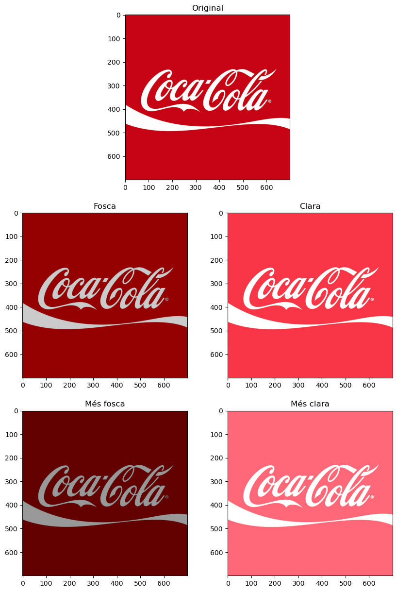{width=95%}</center>


#### Multipliquem per modificar el contrast

Just com l'addició pot resultar en un canvi de brillantor, la multiplicació es pot utilitzar per millorar el contrast de la imatge.

**El contrast és la diferència en els valors d'intensitat dels píxels d'una imatge**. Multiplicar els valors d'intensitat per una constant pot fer que la diferència sigui més gran o més petita (si el factor de multiplicació és < 1).

!!! example "Modifiquem el contrast"

    ```python
    img_bgr = cv2.imread("New_Zealand_Coast.jpg", cv2.IMREAD_COLOR)
    img_rgb = cv2.cvtColor(img_bgr, cv2.COLOR_BGR2RGB)

    matrix1 = np.ones(img_rgb.shape) * 0.8
    matrix2 = np.ones(img_rgb.shape) * 1.2

    img_rgb_darker   = np.uint8(cv2.multiply(np.float64(img_rgb), matrix1))
    img_rgb_brighter = np.uint8(cv2.multiply(np.float64(img_rgb), matrix2))

    # Show the images
    plt.figure(figsize=[18,5])
    plt.subplot(131); plt.imshow(img_rgb_darker);  plt.title("Menor contrast");
    plt.subplot(132); plt.imshow(img_rgb);         plt.title("Original");
    plt.subplot(133); plt.imshow(img_rgb_brighter);plt.title("Major Contrast");
    ```

    <center>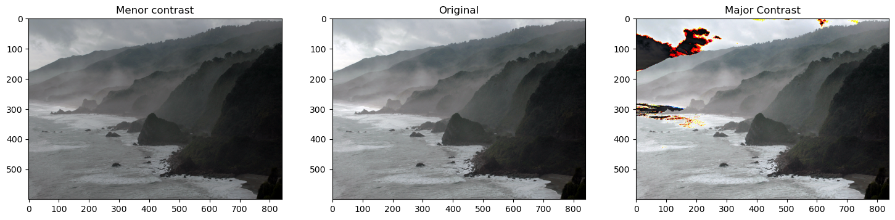{width=95%}</center>

Podeu veure els colors estranys en algunes àrees de la imatge després de la multiplicació?

El problema és que després de la multiplicació, els valors que ja són alts es tornen més grans que 255. Això provoca un problema de desbordament. Com ho podem evitar?

??? question "Solució amb np.clip()"

    Amb la funció `np.clip()`  de numpy, ens permeta ajustar qualssevol valor per baix o dalt de dos donats a els valors indicats, **sobretot al multiplicar**.

    ```python
    img_rgb_lower  = np.uint8(cv2.multiply(np.float64(img_rgb), matrix1))
    img_rgb_higher = np.uint8(np.clip(cv2.multiply(np.float64(img_rgb), matrix2), 0, 255))
    ```

    <center>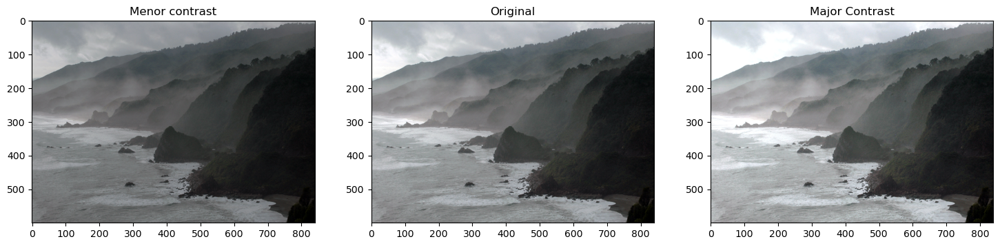{width=95%}</center>

#### Umbralització d'imatges

Les imatges binàries (imatges en blanc i negre) tenen molts casos d'ús en el processament d'imatges. Un dels casos d'ús més comuns és la creació de màscares o detecció de vores.

Les màscares d'imatges ens permeten processar parts específiques d'una imatge mantenint les altres parts intactes. La umbralització d'imatges s'utilitza per crear imatges binàries a partir d'imatges en escala de grisos. Podeu utilitzar diferents valors de llindar per crear diferents imatges binàries a partir de la mateixa imatge original.

La sintaxi és `retval, dst = cv2.threshold(src, thresh, maxval, type[, dst])`, on:

- `dst`: L'array de sortida del mateix tamany i tipus i el mateix nombre de canals que `src`.
- `src`: array d'entrada (de múltiples canals, de 8 bits o de punt flotant de 32 bits).
- `thresh`: valor de llindar. És el límit a partir del qual els píxels es convertiran en un valor específic, determinat pel paràmetre type, normalment o 0 o 1.
- `maxval`: valor màxim a utilitzar amb els tipus de umbralització `THRESH_BINARY` i `THRESH_BINARY_INV`.
- `type`: És el tipus d'operació de thresholding que es vol aplicar. Pots utilitzar els següents valors:
  - `cv2.THRESH_BINARY`: Si el valor del píxel és més gran que el valor de threshold, es posa al valor `maxval`; si no, es posa a 0.
  - `cv2.THRESH_BINARY_INV`: És al contrari de `cv2.THRESH_BINARY`. Si el valor del píxel és més gran que el valor de threshold, es posa a 0; si no, es posa a `maxval`.
  - `cv2.THRESH_TRUNC`: Tots els valors més grans que el valor de threshold es posen iguals al valor de threshold.
  - `cv2.THRESH_TOZERO`: Tots els valors més petits que el valor de threshold es posen a 0.
  - `cv2.THRESH_TOZERO_INV`: És al contrari de `cv2.THRESH_TOZERO`. Tots els valors més grans que el valor de threshold es posen a 0.

D'altra banda tenim la funció d'una umbralització adaptativa, que té l'avantatge d'adaptar-se localment als canvis de la intensitat de la imatge. En lloc d'utilitzar un únic valor de threshold per a tota la imatge, **l'adaptació s'ajusta en funció de petites regions de la imatge**, permetent detectar els umbrals de manera disinta segons la part de la imatge en la que estem.

La sintaxi és bastant semblant `dst = cv.adaptiveThreshold(src, maxValue, adaptiveMethod, thresholdType, blockSize, C[, dst])`, on:

- `dst`: Imatge de destinació del mateix tamany i tipus que `src`.
- `src`: Imatge d'origen de 8 bits i un sol canal.
- `maxValue`: Valor no nul assignat als píxels per als quals es compleix la condició.
- `adaptiveMethod`: Algorisme de umbralització adaptativa a utilitzar. S'utilitza `BORDER_REPLICATE` o `BORDER_ISOLATED` per processar els límits.
- `thresholdType`: Tipus de umbralització que ha de ser THRESH_BINARY o THRESH_BINARY_INV.
- `blockSize`: Mida d'un veïnat de píxels que s'utilitza per calcular un valor de llindar per al píxel: 3, 5, 7, i així successivament.
- `C`: Constant que es resta de la mitjana o mitjana ponderada. Normalment, és positiu, però també pot ser zero o negatiu.

!!! example "Detectem finestres"
    En aquest exemple anem a intentar detectar zones de la imatge. Apliquem 3 filtres i marquem en la màscara resultant aquells píxels que son menors que 50, 100 i 150, respectivament:

    ```python
    img_read = cv2.imread("building-windows.jpg", cv2.IMREAD_GRAYSCALE)

    fig, axes = plt.subplots(nrows=2, ncols=2, figsize=(14, 14))
    axes = axes.flatten()

    img_read = cv2.imread("building-windows.jpg", cv2.IMREAD_GRAYSCALE)
    axes[0].imshow(img_read, cmap="gray");axes[0].set_title("Original")

    for i in range(1,4):
    retval, img_thresh = cv2.threshold(img_read, i*50, 255, cv2.THRESH_BINARY)
    axes[i].imshow(img_thresh, cmap="gray");axes[i].set_title("Llindar <" + str(i*50))

    plt.tight_layout()
    ```

    <center>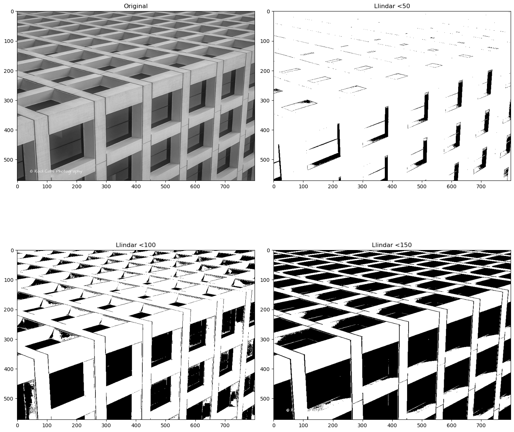{width=100%}</center>

Anem a aplicar el mateix process a altra imatge, la captura de la qual te una sèrie de ombres. El resultat del codi anterior seria el següent:

<center>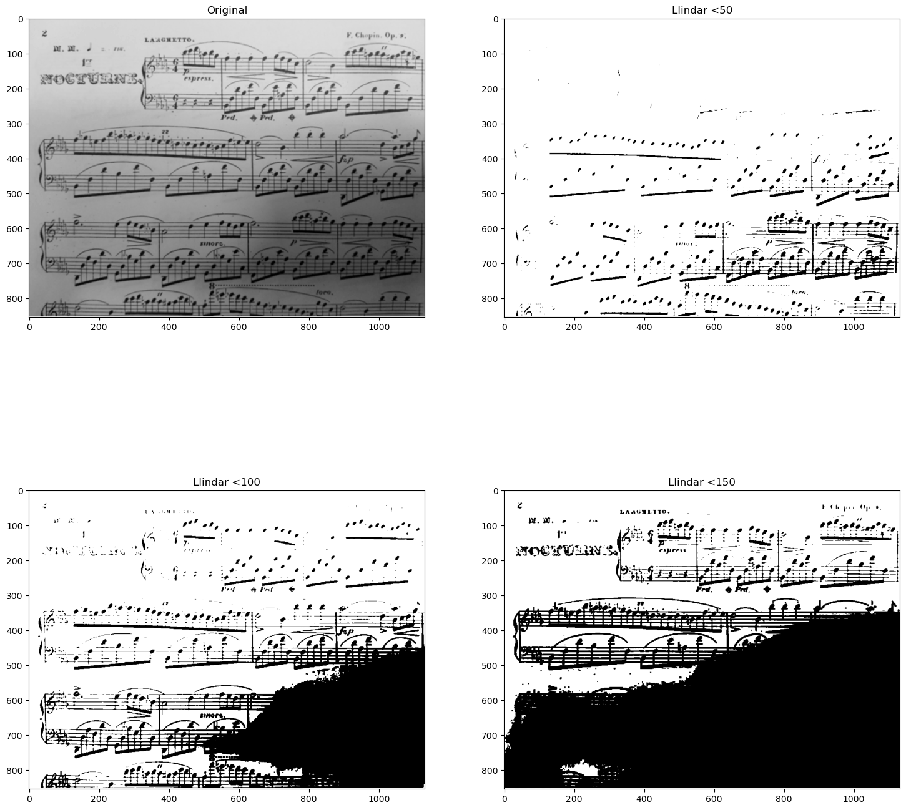{width=100%}</center>

Com pots observar la detecció ha estat incorrecta en la zona ombrejada, degut al fons de mala qualitat. És per això que necessitem una detecció adaptativa, la que puja el llindar segons la zona de la imatge:

!!! example "Detecció adaptativa"
    
    ```python
    img_read = cv2.imread("Piano_Sheet_Music.png", cv2.IMREAD_GRAYSCALE)

    # Perform global thresholding
    retval, img_thresh_gbl_1 = cv2.threshold(img_read, 50, 255, cv2.THRESH_BINARY)

    # Perform global thresholding
    retval, img_thresh_gbl_2 = cv2.threshold(img_read, 130, 255, cv2.THRESH_BINARY)

    # Perform adaptive thresholding
    img_thresh_adp = cv2.adaptiveThreshold(img_read, 255, cv2.ADAPTIVE_THRESH_MEAN_C, cv2.THRESH_BINARY, 11, 7)

    # Show the images
    plt.figure(figsize=[18,15])
    plt.subplot(221); plt.imshow(img_read,        cmap="gray");  plt.title("Original");
    plt.subplot(222); plt.imshow(img_thresh_gbl_1,cmap="gray");  plt.title("Llindar (global: 50)");
    plt.subplot(223); plt.imshow(img_thresh_gbl_2,cmap="gray");  plt.title("Llindar (global: 130)");
    plt.subplot(224); plt.imshow(img_thresh_adp,  cmap="gray");  plt.title("Adaptatiu");
    ```

    <center>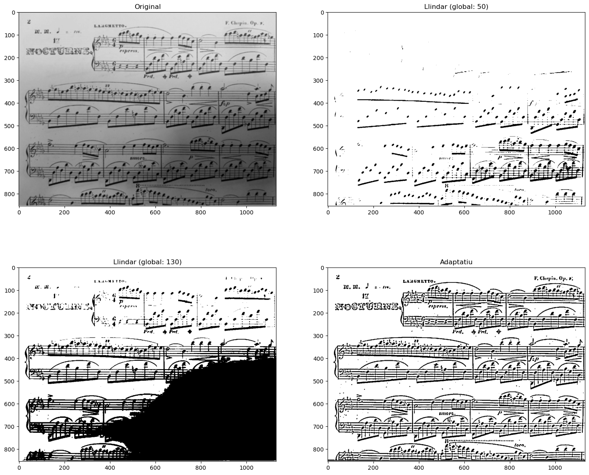{width=95%}</center>


En OpenCV, per defecte, quan s'aplica una **màscara a una imatge**, generalment es processen les àrees de la imatge que estan en **blanc** en la màscara. Això significa que les operacions es apliquen a les regions on els píxels de la màscara tenen valors no nuls. Ara vorem com podem invertir i combinar imatges per a conseguir máscares més precisses, mitjançant operacions a nivell de bit o _bitwise_

#### Operacions a nivell de bit

Anem a veure una serie d'operacions que efectuen operacions a nivell de bit entre els píxels de les imatges. Totes tenen la mateixa sintaxi, sols canvia l'operació efectuada (and,or, not, etc). 

Aquestes operacions solen aplicar-se per aplicar màscares, combinar imatges, seleccionar regions i demés. Principalment es fan servir en escala de negres

La sintaxi de les funcions és:

```python
dst = cv2.bitwise_and( src1, src2[, dst[, mask]] )
dst = cv2.bitwise_or( src1, src2[, dst[, mask]] )
dst = cv2.bitwise_xor( src1, src2[, dst[, mask]] )
dst = cv2.bitwise_not( src1)
```

Com pot observar-se:

- `src1` i `src2` son les imatges que es combinene donant com a resultat `dst`. 
- **Important** és `mask`, que és una imatge de la mateixa dimensió, que cas d'estar, ja que és opcional, aplica el resultats sols als bits que estan en blanc i que tenen valor de 1 (255 en binari) als seus píxels.

Vegem alguns exemples, partint de les següents imatges:

!!! example "Imatges i màscares de partida"

    ```python
    img_rec = cv2.imread("rectangle.jpg", cv2.IMREAD_GRAYSCALE)
    img_cir = cv2.imread("circle.jpg", cv2.IMREAD_GRAYSCALE)
    mask=np.zeros(img_rec.shape, dtype="uint8")
    mask[125:,:] = 255

    plt.figure(figsize=[20, 8])
    plt.subplot(131);plt.imshow(img_rec, cmap="gray");plt.title("Rectangle")
    plt.subplot(132);plt.imshow(img_cir, cmap="gray");plt.title("Cercle")
    plt.subplot(133);plt.imshow(mask, cmap="gray");plt.title("Máscara")
    print(img_rec.shape)
    ```

    <center>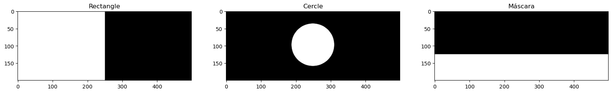{width=100%}</center>


!!! example "Operacions amb i sense màscara"

    ```python
    and_img = cv2.bitwise_and(img_rec, img_cir, mask=None)
    and_img_masked = cv2.bitwise_and(img_rec, img_cir, mask=mask)

    or_img = cv2.bitwise_or(img_rec, img_cir, mask=None)
    or_img_masked = cv2.bitwise_or(img_rec, img_cir, mask=mask)

    xor_img = cv2.bitwise_xor(img_rec, img_cir, mask=None)
    xor_img_masked = cv2.bitwise_xor(img_rec, img_cir, mask=mask)

    not_image=cv2.bitwise_not(img_cir, mask=None) 
    not_image_masked=cv2.bitwise_not(img_cir, mask=mask) 

    plt.figure(figsize=[8, 10])

    plt.subplot(421);plt.imshow(and_img, cmap='gray');plt.title('Bitwise AND')
    plt.subplot(422);plt.imshow(and_img_masked, cmap='gray');plt.title('Masked AND')

    plt.subplot(423);plt.imshow(or_img, cmap='gray');plt.title('Bitwise OR')
    plt.subplot(424);plt.imshow(or_img_masked, cmap='gray');plt.title('Masked OR')

    plt.subplot(425);plt.imshow(xor_img, cmap='gray');plt.title('Bitwise XOR')
    plt.subplot(426);  plt.imshow(xor_img_masked, cmap='gray');plt.title('Masked XOR')

    plt.subplot(427);plt.imshow(not_image, cmap='gray');plt.title('Bitwise NOT')
    plt.subplot(428);plt.imshow(not_image_masked, cmap='gray');plt.title('Masked NOT')

    plt.tight_layout()
    plt.show()
    ```

    <center>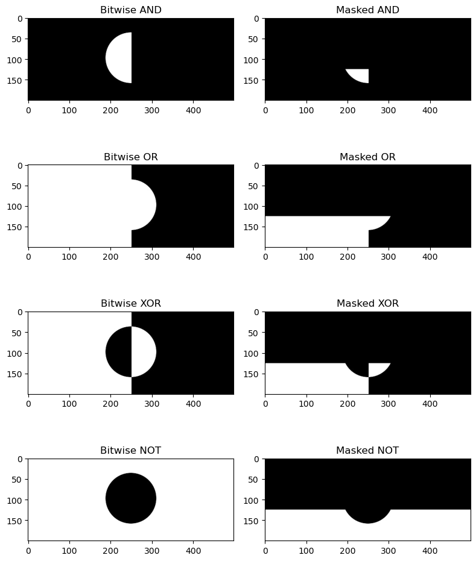{width=100%}</center>

### Activitat pràctica.

A partir d'aquestes imatges facilitades, fes la composició tal i com s'indica

{width=45% align=left}

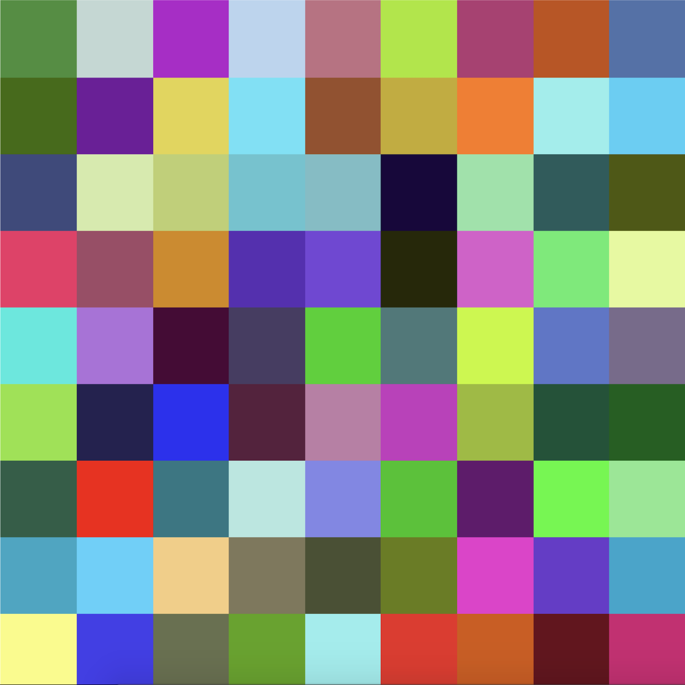{width=45% align=right}

<center>{width=100%}</center>

### Pràctica Resolta - Núvols de paraules

<https://www.datacamp.com/tutorial/wordcloud-python>
Anem

## 2. PIL
 
### Conversió entre OpenCV i PIL

 ### Funcions bàsiques de PIL

<https://github.com/AprendeIngenia>

https://www.youtube.com/watch?v=OArR9c_OXaY&t=2s


